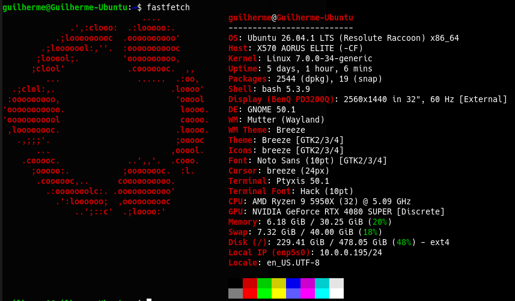
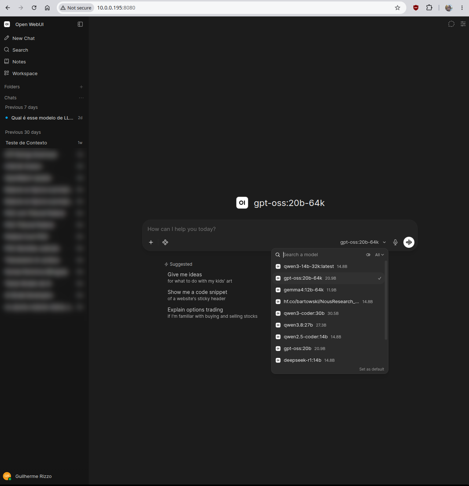
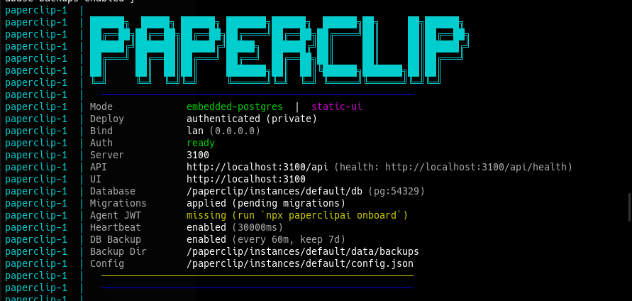
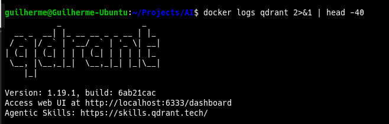
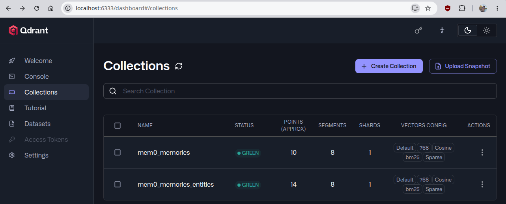

# AI Services Reinstall Guide

Step-by-step guide to reinstall all AI-related services on a fresh Ubuntu setup.

## Table of Contents

- [Hardware Reference](#hardware-reference) — machine specs, disk layout
- [0. Before You Start](#0-before-you-start) — git setup, cloning this repo, what is *not* in the repo (data, secrets)
- [1. NVIDIA Driver & CUDA Setup](#1-nvidia-driver--cuda-setup) — driver install, `nvidia-smi`, optional CUDA Toolkit
- [2. Ollama Installation](#2-ollama-installation) — install, model storage path, model list, global setting `OLLAMA_MAX_LOADED_MODELS=2`, 64K context variants (Modelfiles)
- [3. Open WebUI (Docker)](#3-open-webui-docker) — Docker install, container, restart policy, LAN/remote access, users
- [4. Post-Install Checklist](#4-post-install-checklist) — verification for the base stack and the agents stack
- [5. Mem0 — Agent Memory Layer](#5-mem0--agent-memory-layer-venv-graph-memory) — **legacy/retired** library setup; Neo4j + APOC (stopped, kept for the Graphiti evaluation)
- [6. Git — `~/Projects/AI` repo](#6-git--projectsai-repo) — `.gitignore`, nested repos
- [7. CrewAI — Personal Crew](#7-crewai--personal-crew-venv-yaml-config-mem0-api-called-by-hermes) — Python 3.12 venv, memory/web tools, `run_crew.py`, YAML config + quick editing guide (7.5), Hermes ↔ Crew integration, troubleshooting
- [8. Paperclip Agent Manager](#8-paperclip-agent-manager-docker) — clone, `.env` secret, Docker Compose, restart policy, first login, verify, updating
- [9. Hermes Agent](#9-hermes-agent-orchestrator-for-the-crewai-team) — official installer, model choice (`gpt-oss:20b`), 64K variants, wizard choices, config fixes, validation tests, troubleshooting, first-install history (9.12)
- [10. Shared Memory — Mem0 Server + Qdrant Server](#10-shared-memory--mem0-server-docker--qdrant-server) — Qdrant in Docker, patched Mem0 server (Ollama + Qdrant), Hermes memory provider, auto-sync block, `SOUL.md` memory rules, weekly validation report + timer, per-client API keys (10.12)
- [11. Telegram Bot (Hermes Gateway)](#11-telegram-bot-hermes-gateway) — BotFather, secrets in `~/.hermes/.env`, auto-installed `python-telegram-bot`, gateway as a `systemd` user service, `/sethome`, long-message splitting, Crew without `--verbose`, validation, quick guide to using the bot (11.9)
- [Pending / To Investigate](#pending--to-investigate) — open items
- [Notes](#notes) — cross-cutting reminders

## Hardware Reference



| Component   | Spec                                                                   |
| ----------- | ---------------------------------------------------------------------- |
| CPU         | AMD Ryzen 9 5950X                                                      |
| RAM         | 32GB 3600MHz                                                           |
| GPU         | GeForce RTX 4080 SUPER 16GB                                            |
| Motherboard | Aorus X570 Elite                                                       |
| OS Drive    | Samsung SSD 990 PRO 2TB (500GB Ubuntu / 1.3TB Windows / 200GB Bazzite) |

> This guide targets the **Ubuntu** partition (500GB). Ubuntu 26.04 LTS ("resolute") ships only Python 3.14 by default — see Section 7.1 for why a second Python version is needed for CrewAI.

---

## 0. Before You Start

### 0.1 Clone this repo

The scripts and config files referenced in this guide (e.g. `ai-agents/crewai/run_crew.py`, `ai-agents/mem0-server/docker-compose.yml`) live in this repo. On a fresh install, clone it first:

```
sudo apt install git
git config --global user.name "Your Name"
git config --global user.email "you@example.com"
mkdir -p ~/Projects
git clone https://github.com/rizzo9555/AI.git ~/Projects/AI
```

### 0.2 What is *not* in this repo

By design (see `.gitignore`, Section 6), the repo holds no data and no secrets. These must be backed up **before** wiping the Ubuntu partition, and restored afterwards:

- Open WebUI data — Docker volume `open-webui` (users, chats, settings)
- Shared memories (current, Section 10) — `ai-agents/qdrant/storage/` (Qdrant server data) and `ai-agents/mem0-server/postgres-data/` + `ai-agents/mem0-server/history/` (Mem0 server auth DB and audit trail)
- Neo4j data (Section 5, stopped, empty) — `ai-agents/mem0/neo4j/` (the legacy `qdrant_data/` was deleted on 2026-09-30)
- Crew run outputs (Section 7) — `ai-agents/crewai/outputs/` (personal content, optional)
- Paperclip data — `ai-agents/paperclip/data/`
- Hermes Agent config/data — `~/.hermes/` (`config.yaml`, `.env`, `mem0.json`, `SOUL.md`, sessions, memories); outside the repo by design (Section 9.1). The memory-related pieces are also written out in Section 10; the Telegram pieces in Section 11. `~/.hermes/.env` also holds the Telegram bot token.
- Every `.env` file (Neo4j password, Paperclip's `BETTER_AUTH_SECRET`, Mem0 server's `POSTGRES_PASSWORD`/`JWT_SECRET`/`ADMIN_API_KEY`, the Crew's `MEM0_API_KEY` in `ai-agents/crewai/.env`, the `TELEGRAM_BOT_TOKEN` in `~/.hermes/.env`) — also keep these values, and the Mem0 server admin login (Section 10.12), in a password manager
- Optional: Ollama models (`/usr/share/ollama/.ollama/models`, ~110GB) — re-downloadable, just slow

> The backup/restore procedure itself isn't written yet — see Pending.

---

## 1. NVIDIA Driver & CUDA Setup

Install the latest recommended NVIDIA driver:

```
sudo apt update
sudo ubuntu-drivers install
sudo reboot
```
> `ubuntu-drivers install` is the current form of the older `ubuntu-drivers autoinstall` (deprecated alias, same result).

Verify the driver installation:

```
nvidia-smi
```

### Optional: CUDA Toolkit

**Not needed by anything in this guide** — Ollama ships its own CUDA runtime libraries, and nothing here compiles CUDA code. Only install it if a future tool needs `nvcc`. If so, follow NVIDIA's instructions (https://developer.nvidia.com/cuda-downloads) but install only the **`cuda-toolkit`** package — not the `cuda` meta-package, which also installs NVIDIA's own driver and can conflict with the one installed by `ubuntu-drivers` above.

Verify:

```
nvcc --version
```

---

## 2. Ollama Installation

Install Ollama:

```
curl -fsSL https://ollama.com/install.sh | sh
```

Verify the service is running:

```
systemctl status ollama
```

### 2.1 Model Storage Location

Models downloaded via `ollama pull` are stored at:

```
/usr/share/ollama/.ollama/models
```

### 2.2 Reinstalling Models

Pull each model back down:

```
ollama pull qwen3-coder:30b
ollama pull qwen3.8:27b
ollama pull qwen2.5-coder:14b
ollama pull gpt-oss:20b
ollama pull deepseek-r1:14b
ollama pull gemma4:26b
ollama pull gemma4:12b
ollama pull qwen3:14b
ollama pull nomic-embed-text   # embeddings model required by Mem0 (Section 5.3)
```

Plus one model pulled via Hugging Face GGUF instead of the Ollama library. **Currently unused** — it was the orchestrator of the first (reverted) Hermes Agent install, and it **can't be used with Hermes Agent through Ollama**: its Qwen3 base caps context at 40,960 tokens, below Hermes's 64K minimum (Section 9.2). **Kept on purpose** (decided 2026-09-28) for a future test: extending it to 64K via YaRN, probably with llama.cpp directly and a `q8_0` KV cache, to compare against `gpt-oss:20b-64k` (see Pending). On a reinstall, pull it only when that test is on the table:

```
ollama pull hf.co/bartowski/NousResearch_Hermes-4-14B-GGUF:Q4_K_M
```

Verify installed models:

```
ollama list
```

Expected: **10 models** (9 from the Ollama library + the Hermes GGUF), plus the **3 context variants** (`gpt-oss:20b-64k`, `gemma4:12b-64k`, `qwen3-14b-32k`) once Section 2.4 is done — 13 entries total.

### 2.3 Global Setting: `OLLAMA_MAX_LOADED_MODELS=2`

Caps how many models Ollama keeps resident at the same time. Ollama only loads a second model if its memory estimate says it fits next to the first; otherwise it unloads the first one. So `2` is a ceiling, not an obligation, and the 16GB GPU is never overcommitted.

**Why 2 and not 1 (changed 2026-09-28):** with `1`, every Mem0 memory search or add (Section 10) loads the small embedder `nomic-embed-text` (~0.4GB), which **evicts the 12GB orchestrator** `gpt-oss:20b-64k` from VRAM — so Hermes would pay a full model reload on every turn. With `2`, the embedder stays loaded next to the orchestrator. Measured with `ollama ps`: `gpt-oss:20b-64k` 12GB **100% GPU** + `nomic-embed-text` 397MB at **74%/26% CPU/GPU** (it doesn't fully fit in the VRAM left over, but a tiny embedder on the Ryzen CPU is fast enough — milliseconds per search vs. a 12GB reload). Two *big* models still never coexist: `gpt-oss` (12GB) + `gemma4:12b-64k` (8.5GB) don't fit, so Ollama keeps swapping them (Section 9.9).

History: first set to `1` during the first Hermes Agent install; kept through the uninstall/reinstall; raised to `2` when the Mem0 server was introduced.

```
sudo mkdir -p /etc/systemd/system/ollama.service.d
sudo tee /etc/systemd/system/ollama.service.d/override.conf > /dev/null << 'EOF'
[Service]
Environment="OLLAMA_MAX_LOADED_MODELS=2"
EOF
sudo systemctl daemon-reload
sudo systemctl restart ollama
```

Verify it took effect (should print `OLLAMA_MAX_LOADED_MODELS=2`):

```
systemctl show ollama -p Environment --value | tr ' ' '\n' | grep OLLAMA
```

(Prints one variable per line, so nothing gets cut at the screen edge.)

Verify the coexistence in practice (expect two lines in `ollama ps`, `gpt-oss:20b-64k` at `100% GPU`):

```
ollama run gpt-oss:20b-64k "responda apenas: ok"
curl -s http://localhost:11434/api/embed -d '{"model":"nomic-embed-text","input":"teste"}' > /dev/null
ollama ps
```
> `tee` **overwrites** the whole `override.conf`. If more Ollama variables are added later, put them all in this same file, one `Environment=` line each.
> `systemctl restart ollama` unloads every model — an answer in progress in Hermes/Open WebUI gets interrupted.

### 2.4 64K Context Variants (Modelfiles)

Some tools (Hermes Agent, Section 9) talk to Ollama through its OpenAI-compatible `/v1` endpoint, which **ignores per-request context size** (`num_ctx`) — the model silently loads at Ollama's default (4096), even if the tool displays a bigger number. The fix is a model *variant* with the context baked in via a Modelfile. Variants reuse the base model's files (no extra disk space) and don't affect other apps (Open WebUI, Mem0), which keep using the base models.

The Modelfiles are versioned in this repo at `~/Projects/AI/modelfiles/`. Recreate the variants after Section 2.2 (terminal, no venv needed):

```
ollama create gpt-oss:20b-64k -f ~/Projects/AI/modelfiles/gpt-oss-20b-64k.Modelfile
ollama create gemma4:12b-64k -f ~/Projects/AI/modelfiles/gemma4-12b-64k.Modelfile
ollama create qwen3-14b-32k -f ~/Projects/AI/modelfiles/qwen3-14b-32k.Modelfile
```

Each Modelfile is just two lines, e.g.:

```
FROM gpt-oss:20b
PARAMETER num_ctx 65536
```

Verify the real loaded context (column `CONTEXT` should read `65536`):

```
ollama run gpt-oss:20b-64k "responda só: ok"
ollama ps
```

> Ollama **caps** `num_ctx` at the model's trained maximum — a variant can't push a model past its native context. E.g. `qwen3:14b` stays at 40,960 even with `num_ctx 65536` (verified with `ollama ps`). Check a model's native maximum with `ollama show <model>` (line `context length`).

**`qwen3-14b-32k` — why 32K and not the 40,960 ceiling (measured 2026-09-30, used by the Crew's Critic, Section 7.4):** `qwen3` is a dense model with full attention in every layer, so its KV cache costs much more per token than `gpt-oss` (MoE) or `gemma4` (sliding window) — a smaller model can still need more VRAM at the same context.

| Variant | `ollama ps` | Prompt eval | Generation |
|---|---|---|---|
| 40,960 (removed) | 16 GB, 12%/88% CPU/GPU | 146 t/s | 32 t/s |
| **32,768** | 14 GB, **100% GPU** | 221 t/s | **68 t/s** |

Spilling only 12% to the CPU halved the generation speed. Measure with `ollama run <model> --verbose "..." 2>&1 | grep "eval rate"` + `ollama ps`. Unload the orchestrator first (`ollama stop gpt-oss:20b-64k`) so the measurement isn't skewed.

---

## 3. Open WebUI (Docker)



> **Why Ollama stays native and isn't dockerized:** with a dedicated NVIDIA GPU, native Ollama uses the system driver directly with zero extra config. Dockerizing it would require installing and maintaining the NVIDIA Container Toolkit just for GPU passthrough, with no real benefit on a single-machine setup. Open WebUI itself doesn't touch the GPU (it's just the web interface), so only it needs to be containerized — the NVIDIA Container Toolkit step is skipped entirely.

### 3.1 Install Docker

Using Docker's official install script (simpler than the manual apt-repository method, works across distros):

```
curl -fsSL https://get.docker.com -o get-docker.sh
sudo sh get-docker.sh
```

Allow running Docker without `sudo` (optional but recommended):

```
sudo usermod -aG docker $USER
```
> Log out and back in (or restart the terminal/session) for the group change to take effect.

Confirm the Docker service is running and enabled to start on boot:

```
sudo systemctl status docker
sudo systemctl is-enabled docker   # should say "enabled"; if not: sudo systemctl enable docker
```

Verify Docker:

```
docker run hello-world
```

### 3.2 Run Open WebUI

Since Ollama runs natively (not in Docker), Open WebUI is run with `--network=host` so the container shares the host's network stack and can reach Ollama directly at `127.0.0.1:11434` — no port mapping or `host.docker.internal` needed on Linux.

```
docker run -d \
  --name open-webui \
  --network=host \
  -v open-webui:/app/backend/data \
  -e OLLAMA_BASE_URL=http://127.0.0.1:11434 \
  --restart unless-stopped \
  ghcr.io/open-webui/open-webui:main
```

Access the interface at:

```
http://localhost:8080
```
> Note: `--network=host` is Linux-specific and is why the port is 8080 directly (no `-p` mapping) rather than remapped to 3000 as on Mac/Windows setups.
> **Restart policy — standard for every container in this guide: `unless-stopped`.** The container comes back after a crash or a reboot, but stays down after a manual `docker stop`. (`always` would bring it back on the next Docker/machine restart even after a manual stop.) Standardized on 2026-09-27; an existing container can be switched without recreating it: `docker update --restart unless-stopped open-webui`.

### 3.3 Verify

```
docker ps
docker logs open-webui
```

### 3.4 LAN Access (other devices at home)

Find the machine's local IP:

```
ip addr show | grep "inet " | grep -v 127.0.0.1
```

From another device on the same network, open `http://<LOCAL_IP>:8080`. If it doesn't connect, check the firewall:

```
sudo ufw status
sudo ufw allow 8080/tcp   # if ufw is active and the port isn't allowed
```
> Consider setting a DHCP reservation for this machine on the router so the local IP doesn't change on reboot.
> **ufw only governs Open WebUI here because it uses the host network.** Containers that publish ports with `-p` (Neo4j, Paperclip) bypass ufw entirely — Docker writes its own iptables rules — which is why Neo4j is bound to `127.0.0.1` in Section 5.2.

### 3.5 Remote Access (internet)

Not yet configured. Preferred approach when needed: a VPN (e.g. Tailscale) rather than a public reverse proxy — no ports exposed to the internet, simplest to set up for personal use.

### 3.6 First Login & Users

The first account created at `http://localhost:8080` becomes the admin automatically. Additional users (e.g. family members) are added manually via *Admin Panel → Users → Add User*. The "email" field is required as a login identifier but doesn't need to be a real, working address (e.g. `name@family.local` works fine — nothing is sent to it).

---

## 4. Post-Install Checklist

**Base stack (Sections 1–3):**

- [ ] `nvidia-smi` shows the RTX 4080 SUPER correctly
- [ ] `ollama list` shows all 10 models (Section 2.2) plus the 2 `-64k` variants (Section 2.4)
- [ ] `systemctl show ollama -p Environment --value | tr ' ' '\n' | grep OLLAMA` prints `OLLAMA_MAX_LOADED_MODELS=2` (Section 2.3)
- [ ] `sudo systemctl is-enabled docker` returns `enabled`
- [ ] Open WebUI loads at `http://localhost:8080`
- [ ] Open WebUI can see and query the Ollama models
- [ ] GPU usage confirmed during inference (`nvidia-smi` while running a prompt)
- [ ] Open WebUI reachable from another device via `http://<LOCAL_IP>:8080`
- [ ] Admin account created; additional family user accounts added

**Agents stack (Sections 5–10)** — check after finishing those sections:

- [ ] `python run_crew.py pessoal "..."` (Section 7.3, CrewAI `venv` active) prints a final answer and `OUTPUT_DIR=`, and that folder has `pedido.md` + 4 task files
- [ ] In `hermes`, "Peça para a crew pessoal: ..." runs the Crew through the terminal tool and relays the answer + folder (Section 7.6)
- [ ] `python3 mem0_admin.py list-keys` (inside `ai-agents/mem0-server`, no venv) shows the `crewai` and `hermes` keys (Section 10.12)
- [ ] Paperclip loads at `http://localhost:3100`, and the checks in Section 8.6 print `ENV OK` and `SECRET MATCHES`
- [ ] Hermes Agent: `hermes doctor` shows no `✗` lines, and the 4 tests in Section 9.10 pass (basic chat, `-c 65536` in the Ollama logs, tool calling, vision)
- [ ] Qdrant answers at `curl -s http://localhost:6333/` (Section 10.2)
- [ ] Mem0 server: `/docs` returns HTTP 200, a request without key returns 401, and add/search work (Section 10.6)
- [ ] `hermes memory status` shows `Provider: mem0` + `available ✓`, and the canary test passes (Section 10.8)
- [ ] `systemctl --user list-timers mem0-report.timer --no-pager` shows the next Monday run (Section 10.9)
- [ ] `hermes gateway status` shows `hermes-gateway.service` active + linger enabled, the log shows `Connected to Telegram (polling mode)`, and the bot answers a simple message (Section 11.4)
- [ ] From Telegram: a memory canary is confirmed in `docker logs mem0-server` and a Crew request creates a new folder in `crewai/outputs/pessoal/` (Section 11.8)
- [ ] Every running container uses the `unless-stopped` restart policy (`neo4j-mem0` is intentionally stopped with `no` — Section 5.2):

```
docker inspect -f '{{.Name}} {{.HostConfig.RestartPolicy.Name}}' open-webui docker-paperclip-1 qdrant mem0-server mem0-postgres neo4j-mem0
```

---

## 5. Mem0 — Agent Memory Layer (venv, Graph Memory)

> **⚠️ Legacy — superseded by Section 10 (2026-09-29).** The shared memory now runs as a **Mem0 server in Docker** backed by a **Qdrant server**, used by both Hermes and (soon) the Crew. Two findings retired this section:
> 1. **Mem0 2.0.0 (2026-04-14) removed external graph stores (Neo4j, Memgraph, Kuzu, Apache AGE) from the open-source SDK.** Graph memory became built-in *entity linking*: entities are extracted with spaCy and stored in a parallel `{collection}_entities` collection inside the vector store. The `graph_store` block below is **silently ignored** by every `mem0ai` 2.x — confirmed on 2026-09-28: the Neo4j database had 0 nodes and 0 relationships despite memories being written.
> 2. Embedded Qdrant can only be opened by one process at a time, so it can't be shared between Hermes and the Crew.
>
> Kept below as a record of how the library setup worked. **Retired on 2026-09-30:** `qdrant_data/`, `venv-mem0`, `config.py` and `test_mem0.py` were deleted after the Crew moved to the Mem0 server API; `ai-agents/mem0/` now holds only `neo4j/` and the `.env` with the Neo4j password. **Neo4j** (`neo4j-mem0`) is **stopped** with restart policy `no` — kept (empty) only while Graphiti, a temporal knowledge-graph memory that runs on Neo4j, is evaluated (see Pending).

Gives agents (starting with CrewAI) persistent memory: a vector store (Qdrant, embedded/local) for semantic recall plus a graph store (Neo4j) for entity/relationship memory. Runs as a Python library inside a dedicated venv — not the official Docker server bundle, since that bundle only supports OpenAI/Anthropic/Gemini out of the box (solved later by patching it — Section 10). Fully local via Ollama.

### 5.1 Create the venv and install Mem0

```
mkdir -p ~/Projects/AI/ai-agents/mem0 && cd ~/Projects/AI/ai-agents/mem0
python3 -m venv venv-mem0
source venv-mem0/bin/activate
pip install mem0ai ollama neo4j langchain-neo4j python-dotenv
```
> Note: as of `mem0ai` 2.2.0, the `[graph]` install extra was dropped — the `neo4j`/`langchain-neo4j` packages must be installed manually, as above. The `ollama` package (official Python client) is also required separately for the Ollama embedder to work.
> **Watch out — `mem0ai[extras]` is not for fastembed/BM25.** It's a bundle for cloud vector-store integrations (AWS Bedrock, OpenSearch, Elasticsearch) and pulls in `boto3`, `elasticsearch`, `opensearch-py`, plus older `langchain`/`langchain-community` packages. If `langgraph`/`langchain-neo4j` are installed in the same venv, this downgrades `langchain-core` and breaks them. For BM25 keyword search, install `fastembed` directly instead — see Section 7.2.1.
> **Version drift (pending):** this venv installs `mem0ai` unpinned (2.2.0 as of 2026-09-27), while the CrewAI venv pins `2.0.14` (Section 7.2) — and both read/write the same Qdrant and Neo4j data. Works so far; aligning them is listed under Pending.

### 5.2 Run Neo4j locally (Docker, with APOC plugin)

Graph Memory requires the **APOC** plugin enabled:

```
mkdir -p ~/Projects/AI/ai-agents/mem0/neo4j/data ~/Projects/AI/ai-agents/mem0/neo4j/plugins

docker run -d \
  --name neo4j-mem0 \
  -p 127.0.0.1:7474:7474 -p 127.0.0.1:7687:7687 \
  -v ~/Projects/AI/ai-agents/mem0/neo4j/data:/data \
  -v ~/Projects/AI/ai-agents/mem0/neo4j/plugins:/plugins \
  -e NEO4J_AUTH=neo4j/CHANGE_ME_ON_FIRST_BOOT \
  -e NEO4J_apoc_export_file_enabled=true \
  -e NEO4J_apoc_import_file_enabled=true \
  -e NEO4J_apoc_import_file_use__neo4j__config=true \
  -e NEO4J_PLUGINS='["apoc"]' \
  --restart unless-stopped \
  neo4j:2026.09.0
```

- Port `7474`: Neo4j Browser (`http://localhost:7474`)
- Port `7687`: Bolt protocol (used by Mem0 to connect)
- `NEO4J_AUTH` only sets the password on **first boot of an empty data volume**. To change the password later without losing data, log into the Browser and run: `ALTER CURRENT USER SET PASSWORD FROM 'old' TO 'new';`
- `127.0.0.1:` in front of each port — only this machine can reach Neo4j. Mem0 connects via `localhost`, so nothing changes for it. Without the prefix, Docker opens the ports to the whole LAN regardless of ufw (see 3.4).
- `NEO4J_PLUGINS` — current variable name. The older `NEO4JLABS_PLUGINS` (Neo4j 4.x) still works but logs a rename warning on every start.
- `neo4j:2026.09.0` — pinned to the version in use as of 2026-09-27 (`docker exec neo4j-mem0 neo4j --version`) instead of `latest`, so a reinstall doesn't silently jump to a newer release. Upgrade deliberately.

> The container currently running was created with the earlier flags (`NEO4JLABS_PLUGINS`, ports on all interfaces, `neo4j:latest`; restart policy later switched to `unless-stopped` via `docker update`). The data is safe either way, since it lives in the bind-mounted `neo4j/data` folder.

**Current state (2026-09-28): stopped.** Mem0 2.x no longer writes to Neo4j (see the note at the top of Section 5), and the old container had port 7687 open to the whole LAN. It was stopped without deleting anything:

```
docker update --restart no neo4j-mem0
docker stop neo4j-mem0
```

To bring it back (e.g. for the Graphiti evaluation): `docker start neo4j-mem0`, then recreate it with the command above if it's going to be kept.

### 5.3 Ollama models required

```
ollama pull nomic-embed-text
```

(Reuses an existing chat/reasoning model, e.g. `qwen3:14b`, for entity/fact extraction — no separate pull needed.)

### 5.4 Secrets — `.env`

Create `~/Projects/AI/ai-agents/mem0/.env` (gitignored — see Section 6):

```
NEO4J_PASSWORD=your_real_password_here
```

Keep a `.env.example` (no real value, safe to commit) alongside it:

```
NEO4J_PASSWORD=
```

### 5.5 `config.py`

```
import os
from dotenv import load_dotenv
from mem0 import Memory

load_dotenv()

config = {
    "llm": {
        "provider": "ollama",
        "config": {
            "model": "qwen3:14b",
            "ollama_base_url": "http://localhost:11434"
        }
    },
    "embedder": {
        "provider": "ollama",
        "config": {
            "model": "nomic-embed-text",
            "ollama_base_url": "http://localhost:11434"
        }
    },
    "vector_store": {
        "provider": "qdrant",
        "config": {
            "collection_name": "mem0_memories",
            "embedding_model_dims": 768,
            "path": "/home/guilherme/Projects/AI/ai-agents/mem0/qdrant_data"
        }
    },
    "graph_store": {
        "provider": "neo4j",
        "config": {
            "url": "bolt://localhost:7687",
            "username": "neo4j",
            "password": os.getenv("NEO4J_PASSWORD"),
            "database": "neo4j"
        }
    },
    "version": "v1.1"
}

memory = Memory.from_config(config_dict=config)
```
> `embedding_model_dims: 768` matches `nomic-embed-text`'s output size — Mem0's Qdrant default (1536) is sized for OpenAI embeddings and must be overridden or `add`/`search` will fail with a dimension mismatch.
> **Important — Qdrant is running in local/embedded mode, not as a server.** Because `vector_store.config` uses `path` (not `host`/`port`), Qdrant has no separate process — it's a set of files on disk that Python opens directly. This means **only one process can have it open at a time**. Don't run a Mem0 standalone script and the CrewAI integration (Section 7) at the same time — one will fail to open the locked files.

### 5.6 Test

```
# test_mem0.py
from config import memory

conversation = [
    {"role": "user", "content": "Uso Ollama local com uma RTX 4080 Super de 16GB."},
    {"role": "assistant", "content": "Entendido, vou lembrar disso."}
]

memory.add(conversation, user_id="rizzo")

results = memory.search(
    "Qual GPU eu uso?",
    filters={"user_id": "rizzo"},
    limit=3
)
for hit in results["results"]:
    print(hit["memory"])
```

```
python test_mem0.py
```

Verify the graph side by opening `http://localhost:7474` and running `MATCH (n) RETURN n LIMIT 25;` — connected nodes confirm Graph Memory is writing correctly.
> ⚠️ Obsolete with `mem0ai` 2.x: this query returns nothing, because the SDK no longer writes to Neo4j (see the note at the top of Section 5). Entities now live in the `mem0_memories_entities` collection in Qdrant.
> Note: `search()`/`get_all()` require `user_id` inside `filters={}` — passing it as a top-level kwarg (as `add()`/`delete_all()` still accept) raises a `ValueError` on current versions. This applies across `mem0ai` 2.x releases, at least down to `2.0.14`.

---

## 6. Git — `~/Projects/AI` repo

`~/Projects/AI` is a git repository (cloned in Section 0.1). Its root `.gitignore` contains:

```
# Python virtual environments
**/venv*/
__pycache__/
*.pyc

# Local databases (data, not source)
ai-agents/mem0/neo4j/data/
ai-agents/mem0/neo4j/plugins/
ai-agents/mem0/qdrant_data/
ai-agents/qdrant/storage/

# Nested git repos (Paperclip and Hermes Agent are each cloned from their own
# upstream repo — see Sections 8 and 9)
ai-agents/paperclip/
ai-agents/hermes-agent/

# Mem0 server (Section 10): upstream source clone, secrets, runtime data, reports
ai-agents/mem0-server-src/
ai-agents/mem0-server/.env
ai-agents/mem0-server/postgres-data/
ai-agents/mem0-server/history/
ai-agents/mem0-server/reports/

# CrewAI run outputs (Section 7) — personal content
ai-agents/crewai/outputs/

# Secrets
.env
```
> **Nested repo note:** `ai-agents/paperclip/`, `ai-agents/hermes-agent/` and `ai-agents/mem0-server-src/` are each a git clone of their own upstream repo, with their own `.git`. The lines above stop the main `~/Projects/AI` repo from tracking any of them. Paperclip's own upstream `.gitignore` also already ignores its `.env` and `data/`, so neither can be committed by accident from inside that repo either. Hermes Agent doesn't have this issue — its config/secrets live entirely outside the repo, at `~/.hermes` (Section 9.1). Our own Mem0 server files (`ai-agents/mem0-server/`: Dockerfile, compose, patch, report script, systemd units) **are** tracked; only its `.env`, data and reports are not.
> The bare `.env` line already matches `.env` files in any folder; `ai-agents/mem0-server/.env` is listed explicitly anyway, as documentation.
> Reports (`reports/`) are ignored because they contain the text of the memories themselves.
> Fixed 2026-09-27: the committed `.gitignore` used to contain the literal `cat > … << 'EOF'` and `EOF` lines of the heredoc command that was meant to *create* it. The heredoc is a terminal command — only the lines between those two markers belong in the file.

---

## 7. CrewAI — Personal Crew (venv, YAML config, Mem0 API, called by Hermes)

> **✅ Status (2026-10-01): first Crew running and called by Hermes.** The Crew uses the **Mem0 server REST API** (Section 10) for memory — the old `mem0` library tool, its embedded Qdrant and `crewai_mem0_example.py` were retired on 2026-09-30.
> **Change of plan (2026-09-30):** the first Crew is a **personal assistant team** (tasks and day-to-day), not the "Get Contractors Now" Crew. GCN and the legal POC will get their own Crews later.

How it fits together:

```
You ──> Hermes (gpt-oss:20b-64k) ──terminal tool──> venv/bin/python run_crew.py pessoal "<request>"
                                                        │  reads crews/pessoal/agents.yaml + tasks.yaml
                                                        │  Process.sequential, one model per agent (Ollama)
                                                        ├─ tools: buscar_memoria / salvar_memoria ─> Mem0 server API (agent_id crew-pessoal)
                                                        ├─ tool:  buscar_web ─> DuckDuckGo (ddgs, no key)
                                                        └─ writes outputs/pessoal/<date_time>_<topic>/*.md  →  prints final answer + OUTPUT_DIR=
```

### 7.1 Create the venv with Python 3.12

Ubuntu 26.04 ships only Python 3.14 by default, which lacks pre-built wheels for several CrewAI dependencies (e.g. `tiktoken`, which requires a Rust compiler to build from source on 3.14). Python 3.12 is used instead, installed via the Deadsnakes PPA:

```
sudo apt install software-properties-common
sudo add-apt-repository ppa:deadsnakes/ppa -y
sudo apt update
sudo apt install python3.12 python3.12-venv
```

Then create the venv:

```
mkdir -p ~/Projects/AI/ai-agents/crewai && cd ~/Projects/AI/ai-agents/crewai
python3.12 -m venv venv
source venv/bin/activate
```

> Everything below that runs Python needs this venv active (`(venv)` at the start of the prompt). Leave it with `deactivate`. Hermes doesn't activate it — it calls `venv/bin/python` by absolute path, which uses the venv automatically.

### 7.2 Install dependencies

Install in separate steps (one long `pip install` line can trigger `resolution-too-deep`):

```
pip install --upgrade pip setuptools wheel
pip install crewai
pip install python-dotenv
pip install "posthog<6.0.0"
pip install ddgs
pip check            # expected: No broken requirements found.
```

- `crewai` 1.15.22 at install (1.15.23 available — update deliberately, see Pending).
- `posthog<6.0.0` is what `chromadb` (a `crewai` dependency) requires.
- `ddgs` is the DuckDuckGo search library used by `web_tools.py` (9.16.0 at install).
- **Not installed on purpose:** `crewai-tools` (pulls a large dependency tree into a venv that already had conflicts — a 30-line custom tool does the job) and `mem0ai`/spaCy/fastembed (memory now goes through the Mem0 server API; those libraries live inside the server image). Older installs had `neo4j`/`langchain-neo4j` too; they're harmless leftovers.
- On an old venv being cleaned up: `pip uninstall -y mem0ai spacy fastembed en-core-web-sm` (nothing else depended on them — check with `pip show <pkg>`, line `Required-by`).

### 7.3 Files (in `ai-agents/crewai/`, tracked by git unless noted)

```
ai-agents/crewai/
├── .env                 # MEM0_URL, MEM0_USER_ID, MEM0_API_KEY, MEM0_INFER (gitignored)
├── .env.example         # template, no secrets
├── mem0_tools.py        # buscar_memoria / salvar_memoria → Mem0 server REST API (stdlib HTTP)
├── web_tools.py         # buscar_web → DuckDuckGo via ddgs
├── run_crew.py          # generic runner: builds any Crew from crews/<name>/*.yaml
├── crews/
│   └── pessoal/
│       ├── agents.yaml  # agents: model, temperature, tools, role/goal/backstory
│       └── tasks.yaml   # tasks in run order + which earlier tasks each one sees
├── outputs/             # one folder per run (gitignored — personal content)
└── venv/                # gitignored
```

**`.env`** — the API key is created with `mem0_admin.py` (Section 10.12), which writes it straight into the file; never type it by hand:

```
MEM0_URL=http://127.0.0.1:8888
MEM0_USER_ID=rizzo
MEM0_API_KEY=<written by: python3 ../mem0-server/mem0_admin.py create-key crewai ~/Projects/AI/ai-agents/crewai/.env>
# MEM0_INFER=false  -> grava o texto literal, sem LLM e sem entity linking
MEM0_INFER=true
```

**`mem0_tools.py`** — `memory_tools(agent_id, crew_role)` returns the two tools. `buscar_memoria` → `POST /search` with `filters: {user_id}` and `top_k: 5`, so it sees memories from **every** agent (Hermes included), each shown with its `[agent_id]`. `salvar_memoria` → `POST /memories` with `user_id`, the Crew's `agent_id`, `metadata: {source: crewai, crew_role}` and `infer` from `MEM0_INFER`. Uses only the standard library for HTTP (no extra package). Timeout 180 s, because `infer=true` calls the extraction LLM.

**`MEM0_INFER` — measured 2026-09-30:**

| | `infer=false` | `infer=true` (**default**) |
|---|---|---|
| Entity linking (`mem0_memories_entities`) | **none** (2 → 2) | yes (2 → 8) |
| Time per save | instant | ~9 s (`gpt-oss` extraction) |
| Text stored | exactly what the agent wrote | rewritten in English; can add small details that weren't said |
| VRAM | no effect | if the agent uses another model, forces a swap to `gpt-oss` and back |

`true` was chosen for the entity linking and a format consistent with Hermes's memories; the weekly report (10.9) catches bad rewrites. Do **not** add the Crew's `agent_id` to `MEM0_SKIP_INFER_AGENTS` (10.8), or `infer=true` saves would be silently dropped. Deleting a memory also deletes its entities (verified).

**`run_crew.py`** — usage, CrewAI venv active (or via `venv/bin/python`):

```
cd ~/Projects/AI/ai-agents/crewai
source venv/bin/activate
python run_crew.py pessoal "seu pedido aqui"              # only the final answer + OUTPUT_DIR=
python run_crew.py pessoal "seu pedido aqui" --verbose    # also shows every agent's reasoning and tool calls
```

> **`--verbose` is for terminal runs only.** Hermes (CLI or Telegram) never adds it — the log would fill its context (decided 2026-10-03, Section 11.7).

What it does: disables CrewAI telemetry (`CREWAI_DISABLE_TELEMETRY`, `OTEL_SDK_DISABLED`); reads the two YAML files; builds each agent with `LLM(model="ollama/<model>", base_url="http://localhost:11434", temperature=...)`; maps tool names from the YAML to tool objects (an unknown name stops with an error listing the valid ones); uses `agent_id = crew-<crew name>` for memory; prepends **`Today's date: YYYY-MM-DD.`** to every task (models don't know the date — see 7.6); runs with `Process.sequential` and `memory=False`; saves `pedido.md` plus one `<n>_<task>.md` per task in `outputs/<crew>/<YYYY-MM-DD_HHMM>_<topic>/`; prints the final answer and, as the last line, `OUTPUT_DIR=<folder>`.

### 7.4 The personal Crew

| Agent | Model | Temp. | Tools | Job |
|---|---|---|---|---|
| `pesquisador` (Researcher) | `gpt-oss:20b-64k` | 0.2 | memory (search/save), web | Memory first, then a few web searches; brief ≤ 600 words with links + "Uncertainties" |
| `redator` (Writer) | `gpt-oss:20b-64k` | 0.5 | memory (search/save) | Draft, then the final version applying the Critic's valid fixes |
| `critico` (Critic) | `qwen3-14b-32k` | 0.2 | memory (search/save) | Only real problems (≤ 8, zero is fine), each with a concrete fix + verdict |

Tasks (`Process.sequential`), with explicit `context` so each step only sees what it needs — this keeps every prompt small (~300–700 words per step measured, far below the 32K/64K windows):

| # | Task | Agent | Receives (`context`) |
|---|---|---|---|
| 1 | `pesquisa` | pesquisador | only the request |
| 2 | `rascunho` | redator | request + research |
| 3 | `critica` | critico | request + draft (not the raw research) |
| 4 | `final` | redator | request + draft + critique; must end with a **"Rejected suggestions"** section (or "none") |

Why the Critic uses a **different model**: confronting opinions from different model families is a design goal. `qwen3` is from another family than `gpt-oss` and handles tool calls well (`gemma4` failed at that — 9.2). It swaps with `gpt-oss` in VRAM during the run (~20–40 s extra). Answers come in the **request's language** (PT or EN); memories are stored in English.

Measured runs: 1m29s (first, `--verbose`), 1m03s, 1m47s (called by Hermes).

### 7.5 Quick guide — editing the YAML files

Both files are in `ai-agents/crewai/crews/pessoal/`. Edit with any text editor (e.g. `nano crews/pessoal/agents.yaml`; save with Ctrl+O, Enter; exit with Ctrl+X). **No Python changes are needed** for any of the edits below.

**Rules:** indent with **2 spaces, never TAB**; keep the `key: value` shape; text spanning several lines goes after `|`, indented. Instructions to the models are in English (they follow it better); the answer language comes from the request.

**Change an agent's model** (`agents.yaml`):

```yaml
critico:
  model: qwen3-14b-32k     # any name from `ollama list`
```

Prefer a variant with the context baked in (`-64k`, `-32k` — Section 2.4); a plain model loads with only 4096 tokens through Ollama. Check that it fits: run it once, then `ollama ps` → `PROCESSOR` should read `100% GPU`.

**Make an agent more creative or more down-to-earth** — `temperature` is **per agent**, even when two agents share the same model (each agent gets its own LLM object):

```yaml
redator:
  temperature: 0.5   # 0.0 = precise/repeatable ... 1.0 = creative/varied
```

**Give or remove tools:** `tools: [buscar_memoria, salvar_memoria, buscar_web]` — only these three names exist today.

**Limit loops:** `max_iter: 5` — maximum reasoning/tool rounds per task.

**Change what a task does** (`tasks.yaml`): edit `description` (what to do; `{pedido}` is replaced by the request) and `expected_output` (format and size of the result). Size limits here are what keep the context small.

**Control what a task sees:** `context: [rascunho, critica]` — names of **earlier** tasks only (the runner stops with an error if one is out of order). Tasks run in the order they appear in the file.

**Add an agent:** copy a block in `agents.yaml`, rename it, adjust; then point a task in `tasks.yaml` to it with `agent: <name>`.

**Check after editing** (CrewAI venv active):

```
cd ~/Projects/AI/ai-agents/crewai
source venv/bin/activate
python -c "import yaml; a=yaml.safe_load(open('crews/pessoal/agents.yaml')); t=yaml.safe_load(open('crews/pessoal/tasks.yaml')); print({k: v['model'] for k, v in a.items()}); print(list(t))"
```

**New Crew** (e.g. GCN): copy the folder (`cp -r crews/pessoal crews/gcn`), edit both files, run `python run_crew.py gcn "..."`. Its memory `agent_id` becomes `crew-gcn` automatically.

### 7.6 Hermes ↔ Crew integration

Hermes calls the Crew through its **terminal tool**, using the venv's Python by absolute path (no activation needed, works from any folder). Section appended to `~/.hermes/SOUL.md` (backup: `SOUL.md.bak-pre-crew`; outside the repo, so the full text is kept here). The `--verbose` sentence was changed in stage 12 (backup `SOUL.md.bak-pre-telegram`, Section 11.7):

```
## Personal crew (CrewAI)
- The user has a CrewAI team called "personal crew" (Researcher, Writer, Critic). It researches the web and memory, writes a draft, has it reviewed by a different model, and returns a revised final answer.
- Use it ONLY when the user asks for the crew/team, or explicitly asks for researched and reviewed work (comparisons, summaries, guides, plans, emails based on research). For quick questions, answer yourself.
- Run it with the terminal tool, using exactly this command (one line):
  /home/guilherme/Projects/AI/ai-agents/crewai/venv/bin/python /home/guilherme/Projects/AI/ai-agents/crewai/run_crew.py pessoal "<the user's request, in the user's own language>"
- Put the request inside double quotes and escape any double quotes inside it. Never add --verbose (its log fills your context). If the user wants to see the agents working, tell them to run the crew in a terminal with --verbose.
- It takes 1 to 3 minutes. If the terminal tool accepts a timeout, use at least 400 seconds. Wait for it to finish and never start it twice for the same request.
- The last line of the output is OUTPUT_DIR=<folder>. Reply with the final answer printed before that line, without rewriting or shortening it, then tell the user the folder path.
- If the command fails, show the error message. Never invent or summarize a result the crew did not produce.
```

Test (in `hermes`): `Peça para a crew pessoal: compare 3 apps gratuitos de lista de tarefas para usar no celular e no computador, e recomende um.` → one `terminal` call with the command above, ~1–2 min, final answer + folder path.

Timeouts: Hermes's `terminal.timeout` is **180 s** (`~/.hermes/config.yaml`) and the per-tool-call deadline is 420 s — enough for current runs (~1–2 min). If the Crew grows past 3 min, raise `terminal.timeout`.

### 7.7 Troubleshooting notes

- **Task files written to `crewai/home/guilherme/...` instead of `outputs/`:** CrewAI's `output_file` strips the leading `/` from absolute paths and writes relative to the current folder. Fixed by not using `output_file` — `run_crew.py` writes each task from `result.tasks_output` itself.
- **Critic says sources from 2024–2026 are "from the future", or that links are broken:** models don't know today's date (their training cutoff) and can't open links. Fixed with the date line prepended to every task and a Critic rule: never claim a link is broken or a date is wrong without evidence in the draft — mark it "unverified".
- **Critic fills the list up to the maximum / Writer accepts everything:** the Critic now lists only real problems ("fewer is better; zero is fine", no duplicates) and the Writer must list rejected suggestions. Quality tuning continues (Pending).
- **`exit 130` on the Hermes terminal call:** the command was interrupted (SIGINT) — e.g. a key pressed in the Hermes window while it waited. Just ask again.
- **Nothing printed while it runs:** expected without `--verbose`.
- **`resolution-too-deep` on `pip install`:** install packages one at a time (7.2).
- **`tiktoken` build fails needing a Rust compiler:** running on Python 3.14; use the 3.12 venv (7.1).
- **Duplicated `(venv)` in the prompt** (e.g. `(venv) (venv)`): cosmetic, from activating a venv on top of another; close the terminal and open a new one.
- **`OPENAI_API_KEY is required`:** an agent without an explicit `llm=` — `run_crew.py` always sets the Ollama LLM.
- **History (retired setup, 2026-09-23 → 2026-09-30):** the first integration used the `mem0` library with an embedded Qdrant (`crewai_mem0_example.py`), `mem0ai==2.0.14`, spaCy and fastembed in this venv. Lessons kept: CrewAI 1.15.22 has **no** native `"provider": "mem0"` memory (a `memory_config` is silently ignored and falls back to its broken ChromaDB memory, which caused the misleading `memory_save_failed` warning); `mem0ai[extras]` is a cloud-integrations bundle that broke `langchain-core` — for BM25 the right package is plain `fastembed`.

---

## 8. Paperclip Agent Manager (Docker)



Open-source orchestration platform ([paperclipai/paperclip](https://github.com/paperclipai/paperclip)) that manages a team of AI agents (CrewAI, Claude Code, Codex, etc.) like employees in a company — org chart, tickets, budgets, governance. Will also be used in the future "Get Contractors Now" project.
> **Why Docker and not native (Node/pnpm):** Paperclip doesn't touch the GPU, so the reason Ollama stays native doesn't apply here. Docker was chosen for isolation and portability, matching the Open WebUI approach — the official install path builds the image locally from source (no pre-built image to just pull), so the repo still needs to be cloned either way.

### 8.1 Clone the repo

```
cd ~/Projects/AI/ai-agents
git clone https://github.com/paperclipai/paperclip.git
cd paperclip
```

This creates a **nested git repo** inside `~/Projects/AI` — see the `.gitignore` note in Section 6.

### 8.2 Create `.env` with the auth secret

`BETTER_AUTH_SECRET` (session/auth signing key) is required — the quickstart compose file refuses to start without it. Generate it once and keep it in `.env` at the repo root:

```
cd ~/Projects/AI/ai-agents/paperclip
echo "BETTER_AUTH_SECRET=$(openssl rand -hex 32)" > .env
```

- On a reinstall, restore the **old** value from backup instead of generating a new one — a new secret at least invalidates every existing login session.
- `.env` is already ignored by Paperclip's own upstream `.gitignore`, and the outer repo ignores the whole folder (Section 6).

> History: the current install (2026-09-25) passed the secret inline on the first `docker compose up` and saved it to `.env` afterwards, reading it back with `docker exec docker-paperclip-1 env | grep BETTER_AUTH_SECRET`. Same end result.

### 8.3 Run via Docker Compose (official quickstart)

```
cd ~/Projects/AI/ai-agents/paperclip
docker compose --env-file .env -f docker/docker-compose.quickstart.yml up -d
```

- **`--env-file .env` is required.** With `-f docker/...`, Compose looks for `.env` in the compose file's own folder (`docker/`), not in the current folder — without the flag it fails with `required variable BETTER_AUTH_SECRET is missing a value` (confirmed 2026-09-27).
- First run builds the image from the repo's `Dockerfile` (slower); later runs reuse the built image (see 8.7 for updates).
- Persistent data (embedded PostgreSQL, uploads, secrets key, agent workspace data) lives under `data/docker-paperclip/` at the repo root — the compose file's default `../data/docker-paperclip`, resolved from `docker/`. Ignored by upstream's `.gitignore` (`data/`) and by the outer repo (Section 6).
- Access at `http://localhost:3100`.
- Port 3100 is published on all interfaces, so it's open to the LAN regardless of ufw (see 3.4). Paperclip itself still rejects hostnames other than `localhost` until LAN access is configured (see Pending).

> **Container name:** Compose names it `docker-paperclip-1` (derived from the compose file's folder, `docker`, + the service name), **not** `paperclip`. Use the real name for `docker exec`/`docker update` below — check with `docker ps` if unsure.

### 8.4 Keep it always running (survive reboots)

```
docker update --restart unless-stopped docker-paperclip-1
```

Same policy as every container in this guide (see 3.2): restarts automatically after a crash or a reboot; only a manual `docker stop docker-paperclip-1` keeps it down.

> The quickstart compose file has no `restart:` key, so this setting is **lost whenever Compose recreates the container** (e.g. after an update, 8.7). Re-run the command above after every recreate.

### 8.5 First login

Open `http://localhost:3100`. The first account created on the setup screen automatically becomes the instance admin — same as Open WebUI (Section 3.6), the email field doesn't need to be real (no SMTP is configured, so nothing is sent/verified). **Done** — admin account created.

### 8.6 Verify

```
cd ~/Projects/AI/ai-agents/paperclip
docker ps                                   # confirms docker-paperclip-1 is Up
docker compose --env-file .env -f docker/docker-compose.quickstart.yml config > /dev/null && echo "ENV OK"
diff <(grep BETTER_AUTH_SECRET .env) <(docker exec docker-paperclip-1 env | grep BETTER_AUTH_SECRET) > /dev/null && echo "SECRET MATCHES" || echo "SECRET DIFFERS"
```

The last two lines check the setup without printing the secret: `ENV OK` means Compose can read `.env`; `SECRET MATCHES` means `.env` holds the same value the running container uses.

### 8.7 Updating Paperclip

> Not yet exercised on this install.

```
cd ~/Projects/AI/ai-agents/paperclip
git pull
docker compose --env-file .env -f docker/docker-compose.quickstart.yml up -d --build
docker update --restart unless-stopped docker-paperclip-1
```

`--build` forces a rebuild of the image from the updated source — without it, Compose keeps using the old image. The last line restores the restart policy (see 8.4).

---

## 9. Hermes Agent (Orchestrator for the CrewAI Team)


Autonomous agent framework from Nous Research ([hermes-agent.nousresearch.com](https://hermes-agent.nousresearch.com)), used to orchestrate/delegate work to the CrewAI team (Section 7) — first the personal Crew, later per-project Crews (e.g. "Get Contractors Now"). Fully local via Ollama, same as everything else in this stack.

> **✅ Status (2026-09-27): reinstalled from scratch and validated** — tool calling and vision both working. A first install earlier the same day was fully reverted after validation problems; that history is condensed in Section 9.12.

**Summary of the working setup:**

| Role | Model | Measured (`ollama ps`) |
|---|---|---|
| Orchestrator (main model) | `gpt-oss:20b-64k` | 12 GB, 100% GPU, context 65,536 |
| Vision (auxiliary) | `gemma4:12b-64k` | 8.5 GB, 100% GPU, context 65,536 |

### 9.1 Install (official installer)

Terminal, no venv needed. Code goes inside the project folder (convention); config/secrets/sessions stay at the default `~/.hermes`:

```
cd ~/Projects/AI
curl -fsSL https://hermes-agent.nousresearch.com/install.sh | bash -s -- --dir ~/Projects/AI/ai-agents/hermes-agent
```

- `bash -s --` is required to pass flags through `curl | bash`. Without `--dir`, the installer defaults to `~/.hermes/hermes-agent`.
- The installer provisions its own Python runtime/venv under `~/.hermes/installs/...` (Python 3.14 as of this install) and puts `hermes` in `~/.local/bin` — no manual venv activation ever needed to run `hermes`.
- Without `--skip-setup`, it goes straight into the setup wizard at the end (Section 9.4).

### 9.2 Model choice — why `gpt-oss:20b`

Hermes Agent **hard-requires ≥ 64,000 tokens of context**, and (current versions) checks the context Ollama *actually loaded*, not just the configured value. That rules out every Qwen3-based ~14B model:

| Candidate | Native context | Result |
|---|---|---|
| `qwen3:14b` | 40,960 | ❌ Ollama caps at 40,960 even with a 64K Modelfile; and at 40,960 it already spills to CPU (16 GB, 12%/88% CPU/GPU) |
| Hermes-4-14B (hf.co GGUF) | 40,960 (Qwen3 base) | ❌ same ceiling — no longer an option regardless of bug #110442 (Section 9.12) |
| `gemma4:12b` | 262,144 | Fits (8.5 GB @ 64K, 100% GPU) but **failed as orchestrator**: test 1 — tool command failed, then it *invented* the result; test 2 — no tool call at all, returned a blank template with a leaked `<channel|>` token (its native tool-call format not recognized through Ollama `/v1` → Hermes). Fine as a **vision** model. |
| `gpt-oss:20b` | 131,072 | ✅ **Chosen.** MoE (21B total, ~3.6B active per token → fast), trained for tool use. 12 GB @ 64K, 100% GPU. Correct tool calls, no loop, and it cross-checks tool output instead of blindly repeating it. |

Exception to the "~14B for daily use" rule: `gpt-oss:20b` is justified by its MoE design (small active size) and because it fits fully in VRAM at 64K.

### 9.3 Create the 64K variants (before the wizard)

See Section 2.4 — the `/v1` endpoint Hermes uses ignores per-request context, so the models must be `-64k` variants:

```
ollama create gpt-oss:20b-64k -f ~/Projects/AI/modelfiles/gpt-oss-20b-64k.Modelfile
ollama create gemma4:12b-64k -f ~/Projects/AI/modelfiles/gemma4-12b-64k.Modelfile
```

### 9.4 Setup wizard — key choices

Navigate only with arrows / Enter / Space / Esc — **never Ctrl+C** (Section 9.11).

| Prompt | Choice | Why |
|---|---|---|
| Setup mode | **Full setup** | "Quick Setup" logs into the Nous Portal cloud |
| Provider | **Custom endpoint (enter URL manually)** | Near the bottom of the list. Not "custom (direct API)" |
| API base URL | `http://localhost:11434/v1` | Ollama's OpenAI-compatible endpoint |
| API key | blank (Enter) | Marked optional; not needed locally |
| API compatibility mode | **2 — Chat Completions** | Skips Auto-detect's probing of Ollama-native routes (known source of silent hangs) |
| Model | any from the list | Will be switched to `gpt-oss:20b-64k` afterwards (9.7) — the wizard only lists what's installed at that moment |
| Context length | `65536` | Hermes's 64K minimum |
| Display name | default (`Local (localhost:11434)`) | Cosmetic |
| Reasoning effort | `medium` | Changeable per session with `/reasoning` |
| Terminal backend | **Keep current (local)** | Same machine |
| Messaging platforms | none (Enter with nothing checked) | Telegram added later in stage 12 by editing `~/.hermes/.env` (Section 11) |
| Tools (CLI) | see 9.5 | |
| Browser provider | **Local Browser** | Headless Chromium, free |
| Vision backend | Pick a provider and model → Local → Type a custom model id → `gemma4:12b` | ⚠️ **Not persisted by the wizard** — fixed in 9.7 |
| Search provider | **DuckDuckGo (ddgs)** | Free, no key (SearXNG deferred — see Pending) |

### 9.5 Tools

Turned **off** in the wizard: Image Generation, Text-to-Speech, Computer Use (desktop control — much broader than needed). Everything else at defaults, notably **Task Delegation** (`delegate_task`), the core capability here.

### 9.6 Vision backend — known wizard bugs

1. The model picker for the Local provider lists only the main text model (e.g. `qwen3:14b`) as "vision-capable", not the real multimodal models. Workaround in the wizard: "Type a custom model id…".
2. Even then, the choice is **not saved**: `config.yaml` ends up with `auxiliary.vision.provider: auto` / `model: ''`, and `hermes doctor` reports `vision (system dependency not met)`. This (not an `hf.co` capability issue, as first suspected) was the root cause of the `AuxiliaryClientUnavailable` error in the first install.
3. `provider: main` (suggested by comments inside `config.yaml`) is **invalid** in this version — doctor reports `Unknown provider 'main'`, and the task silently falls back to the main (text-only) model.

Fix: create a named provider and point vision to it (9.7).

### 9.7 Post-wizard config fixes

Back up first (terminal, no venv):

```
cp ~/.hermes/config.yaml ~/.hermes/config.yaml.bak-pre-fix
```

Then:

```
hermes config set model.default gpt-oss:20b-64k
hermes config set model.context_length 65536
hermes config set model.ollama_num_ctx 65536
hermes config set providers.ollama-local.api http://localhost:11434/v1
hermes config set providers.ollama-local.api_mode chat_completions
hermes config set auxiliary.vision.provider custom:ollama-local
hermes config set auxiliary.vision.model gemma4:12b-64k
```

- `providers.ollama-local` is also the migration `hermes doctor` asks for (the wizard still writes the legacy `custom_providers:` list). Once it exists, the doctor warning disappears. `hermes doctor --fix` does **not** perform this migration.
- **Remove the legacy `custom_providers:` block afterwards** (done 2026-09-28). It's safe because `model:` carries its own `provider: "custom"` + `base_url` and vision uses `custom:ollama-local` — nothing active points to the legacy list. Back up, find the block's line numbers, delete them, confirm:
  ```
  cp ~/.hermes/config.yaml ~/.hermes/config.yaml.bak-$(date +%Y%m%d)
  grep -n -A8 -E '^(model|custom_providers|providers|auxiliary):' ~/.hermes/config.yaml
  sed -i '<first>,<last>d' ~/.hermes/config.yaml    # use the line numbers of the custom_providers block
  grep -n 'custom_providers' ~/.hermes/config.yaml  # only a comment line may remain
  ```
  Confirm the main model is self-contained first: `sed -n '57,200p' ~/.hermes/config.yaml | grep -vE '^\s*(#|$)'` should show `provider: "custom"` and `base_url` under `model:`.
- `ollama_num_ctx` is harmless but effectively redundant — the `-64k` variants are what actually set the context (Section 2.4).

Verify:

```
hermes doctor 2>&1 | grep -E "✗|custom_providers|vision"
```

Expected: `auxiliary task routing resolves: vision→custom@localhost` and `✓ vision`, no `✗` lines.

### 9.8 Search provider

**DuckDuckGo (ddgs)** — free, no API key. SearXNG self-hosted deferred (see Pending).

### 9.9 VRAM & model swapping

Hermes (`gpt-oss`, 12 GB) and its vision model (`gemma4`, 8.5 GB) don't fit in 16 GB together. With `OLLAMA_MAX_LOADED_MODELS=2` (Section 2.3), Ollama still refuses to load both big models at once — its memory check makes it swap them instead of spilling to CPU — while letting the small `nomic-embed-text` embedder stay loaded next to `gpt-oss` for memory searches (Section 10). In practice, each `vision_analyze` call costs ~30 s: unload `gpt-oss` → load `gemma4` → analyze → reload `gpt-oss`. Acceptable for occasional use.

> Ollama also unloads any model idle for 5 minutes (default `keep_alive`), so the first Hermes turn or Mem0 extraction after a pause pays a reload (~20 s measured).

> CrewAI corollary: the Crew uses `Process.sequential` (Section 7.4), so agents never call their models at the same time. When the Critic (`qwen3-14b-32k`, 14 GB) runs, Ollama swaps it with `gpt-oss` the same way (~20–40 s per run).

### 9.10 Validation tests (2026-09-27)

Terminal, no venv. After each `hermes chat -q ...`, Hermes stays in interactive mode — type `/exit` to leave.

1. **Basic chat:** `hermes chat -q "Responda em uma frase: qual é a capital do Brasil?"` → correct answer.
2. **Real context check** (not just what Hermes displays):
   ```
   ollama ps
   journalctl -u ollama --since "5 minutes ago" --no-pager | grep -E "starting llama-server" | grep -oE "\-\-model [^ ]+|-c [0-9]+"
   ```
   Every load must show `-c 65536`. (Before the Modelfile variants, the status bar showed `65.5K pinned` while Ollama was really loading `-c 4096`.)
3. **Tool calling:** `hermes chat -q "Liste as pastas que existem dentro de ~/Projects/AI e me diga quantas são. Responda em português."` → one `terminal` call, correct answer (compare with `ls -d ~/Projects/AI/*/`), no loop.
4. **Vision:** `hermes chat -q "Use a ferramenta vision_analyze na imagem /usr/share/backgrounds/<file>.png e descreva em português, em 2 frases, o que aparece nela."` → description returned, no `AuxiliaryClientUnavailable`; `ollama ps` afterwards shows `gpt-oss:20b-64k` loaded again.

### 9.11 Troubleshooting notes

- **Ctrl+C during `hermes setup` cancels the entire wizard** and falls into a Nous Portal login flow. If that happens: Ctrl+C again to stop the polling, re-run `hermes setup`.
- **Loop inside a chat:** use `/stop`, not Ctrl+C.
- **`❌ Ollama runtime context is too small for Hermes tool use`**: the model's real loaded context is < 64K. Check the model's native context (`ollama show <model>`) — if it's below 64K, no config can fix it; pick another model.
- **`hermes doctor` harmless warnings:** Nous Portal / Codex / xAI / MiniMax not logged in; OpenRouter not configured; Discord packages not installed (Telegram's is installed on demand since stage 12 — Section 11.3); several tools with "system dependency not met" (a2a, spotify, computer_use, etc. — disabled/unused); agent-browser npm vulnerability (upstream lockfile, #116774 — fixed by a future `hermes update`); Skills Hub not initialized.
- **`SyntaxWarning: "\W" is an invalid escape sequence`** from `pm/shell.py` when a tool runs — cosmetic, Hermes code vs. Python 3.14. Ignore.
- **`sudo systemctl edit ollama.service` doesn't save:** stale `nano` lock file in `/etc/systemd/system/ollama.service.d/.#override.conf...` — remove it and write the override directly (Section 2.3).

### 9.12 History — first install (reverted, 2026-09-27)

First attempt used **Hermes-4-14B** (`hf.co/bartowski/NousResearch_Hermes-4-14B-GGUF:Q4_K_M`) as orchestrator, installed with `--skip-setup`. Problems found during validation:

1. Context: auto-detected at 40,960 (< 64K minimum). Worked around with `context_length`/`ollama_num_ctx: 65536` — which, as learned in the reinstall, Ollama never actually applied via `/v1`.
2. Tool-call loop: collision between the Qwen/Hermes native `<tool_call>` delimiter and Hermes Agent's bridge tool named `tool_call` — [issue #110442](https://github.com/NousResearch/hermes-agent/issues/110442), fix in [PR #110452](https://github.com/NousResearch/hermes-agent/pull/110452) (rename to `invoke_tool`); release status not confirmed. Moot now: the model can't meet the 64K minimum anyway.
3. Vision: `AuxiliaryClientUnavailable` — root cause later identified as the wizard not persisting the vision choice (9.6).

Reverted with:

```
hermes uninstall --yes
rm -rf ~/.hermes
rm -rf ~/Projects/AI/ai-agents/hermes-agent
```

`OLLAMA_MAX_LOADED_MODELS=1` (Section 2.3) was kept at the time (raised to `2` later).

---

## 10. Shared Memory — Mem0 Server (Docker) + Qdrant Server

> **✅ Status (2026-10-01): running, shared by Hermes and the CrewAI Crew** (validated in both directions), each client with its own API key (10.12).

One memory shared by Hermes and the CrewAI team: whatever one agent stores, the others can find. Everything runs locally; nothing reaches a cloud API.

```
Hermes (plugin mem0, self-hosted mode) ─┐
CrewAI tools (mem0_tools.py) ───────────┼─ HTTP + X-API-Key ─> Mem0 server  127.0.0.1:8888  (Docker, network host)
                                         │                        ├─ LLM (fact extraction): gpt-oss:20b-64k  ─┐
                                         │                        ├─ Embedder: nomic-embed-text (768 dims)  ──┴─ Ollama 127.0.0.1:11434
                                         │                        ├─ Vectors + entities: Qdrant 127.0.0.1:6333 (Docker)
                                         │                        └─ Auth/users/API keys/logs: Postgres 127.0.0.1:8432 (Docker)
```

Key facts that shaped the design:

- **No Neo4j.** Mem0 2.x dropped external graph stores; "graph memory" is now entity linking inside the vector store (`mem0_memories_entities` collection). See the note at the top of Section 5.
- **Extraction is ADD-only** in Mem0 2.x: memories accumulate, nothing is updated or deleted automatically. That makes redundancy the main risk — handled by the auto-sync block (10.8) and the weekly report (10.9).
- **Memories are written in English** by the extraction LLM, even from Portuguese input, and **cross-language search works**: the same question in PT and EN scored 0.376 vs 0.377 against the same memory. So the hard-coded English spaCy model (`en_core_web_sm`) is not a problem.
- **Isolation by IDs:** every client uses `user_id: rizzo` (that's what makes the memory shared) and its own `agent_id` (`hermes`; one per Crew: `crew-pessoal`, later `crew-gcn`, …) so it's always known who wrote what. Qdrant indexes `user_id`, `agent_id`, `run_id`, `actor_id`, so filtering is cheap.
- **Everything binds to `127.0.0.1`** — not reachable from the LAN.

### 10.1 Folder layout

```
~/Projects/AI/ai-agents/
├── qdrant/storage/            # Qdrant data (gitignored)
├── mem0-server-src/           # upstream clone, tag v2.2.1 (gitignored, nested repo)
└── mem0-server/               # ours, tracked by git
    ├── Dockerfile
    ├── docker-compose.yml
    ├── local_config.py        # Ollama + Qdrant config, read from env vars
    ├── patch_main.py          # 4 exact-text edits to upstream main.py, applied at build
    ├── mem0_report.py         # weekly validation report (10.9)
    ├── systemd/               # mem0-report.service / .timer (10.9)
    ├── .env.example           # template, no secrets
    ├── .env                   # secrets (gitignored)
    ├── postgres-data/         # gitignored
    ├── history/               # Mem0 audit trail, SQLite (gitignored)
    └── reports/               # weekly reports (gitignored — contains memory text)
```

### 10.2 Qdrant server





Terminal, no venv:

```
mkdir -p ~/Projects/AI/ai-agents/qdrant/storage
docker run -d --name qdrant --restart unless-stopped \
  -p 127.0.0.1:6333:6333 -p 127.0.0.1:6334:6334 \
  -v $HOME/Projects/AI/ai-agents/qdrant/storage:/qdrant/storage \
  qdrant/qdrant:latest
curl -s http://localhost:6333/ ; echo
```

Expected: JSON with `"title":"qdrant - vector search engine"` (version 1.19.1 at install). Port 6333 = REST, 6334 = gRPC. Replaces the embedded Qdrant of Section 5 and can be shared by future projects (e.g. the legal RAG).

### 10.3 Upstream Mem0 server source (pinned)

```
cd ~/Projects/AI/ai-agents
git clone --depth 1 --branch v2.2.1 https://github.com/mem0ai/mem0.git mem0-server-src
```

The "detached HEAD" message is normal when cloning a tag. What the official server does, and why it can't be used as-is:

- FastAPI app (`server/main.py`); on start it builds a `Memory` from a hard-coded `DEFAULT_CONFIG` (**pgvector + OpenAI**) merged with overrides stored in Postgres — without an OpenAI key it breaks at boot.
- `POST /configure` rejects any LLM/embedder provider outside `openai`, `anthropic`, `gemini`.
- **Postgres is mandatory** even when vectors go to Qdrant: it holds users, API keys, request logs and settings in a `mem0_app` database (created by `server/init-db.sh`; tables by `alembic upgrade head`). No SQLite fallback.
- **Auth is on by default:** requires `JWT_SECRET`; clients send `ADMIN_API_KEY` in the `X-API-Key` header. `AUTH_DISABLED=true` is for local development only.
- Telemetry on by default; `MEM0_TELEMETRY=false` turns it off.
- An optional Next.js dashboard (port 3000) exists — not used.

### 10.4 Our files (in `ai-agents/mem0-server/`, tracked by git)

**`local_config.py`** — the config that replaces `DEFAULT_CONFIG`. Every value comes from an env var with a default:

| Setting | Env var | Default | Why |
|---|---|---|---|
| LLM (extraction) | `MEM0_LLM_MODEL` | `gpt-oss:20b-64k` | Same model as Hermes → no VRAM swap |
| LLM max output | `MEM0_LLM_MAX_TOKENS` | `4096` | Covers gpt-oss reasoning + a short JSON answer; caps runaway turns. Raise to 8192 if cut-off JSON errors ever show up in the logs (Pending) — env change + recreate, no rebuild |
| LLM temperature | — | `0.1` | Fact extraction should be predictable |
| Embedder | `MEM0_EMBED_MODEL` / `MEM0_EMBED_DIMS` | `nomic-embed-text:latest` / `768` | Must match everywhere; without `768` Mem0 assumes 1536 (OpenAI) and every insert fails |
| Ollama | `OLLAMA_BASE_URL` | `http://127.0.0.1:11434` | |
| Qdrant | `QDRANT_HOST` / `QDRANT_PORT` / `MEM0_COLLECTION` | `127.0.0.1` / `6333` / `mem0_memories` | |
| Auto-sync block | `MEM0_SKIP_INFER_AGENTS` | empty (nothing blocked) | See 10.8 |

**`patch_main.py`** — runs during the image build and makes **4 exact-text replacements** in upstream `main.py`, **failing the build on purpose** if any expected text isn't found exactly once (protects against silent breakage when upgrading Mem0):

1. `BUNDLED_LLM_PROVIDERS` += `"ollama"`
2. `BUNDLED_EMBEDDER_PROVIDERS` += `"ollama"`
3. Right before `initialize_state(DEFAULT_CONFIG)`: `from local_config import LOCAL_CONFIG as DEFAULT_CONFIG, SKIP_INFER_AGENTS as _SKIP_INFER_AGENTS` (the original `DEFAULT_CONFIG` stays in the file, unused)
4. In `POST /memories`, right after `params = {...}`: if `infer` is true and `agent_id` is in `MEM0_SKIP_INFER_AGENTS`, log `skip_infer: agent_id=...` and return `{"results": [], "skipped": "infer_blocked_for_agent"}` without calling the LLM

Test the patch against a copy before building (no venv, system Python):

```
cd ~/Projects/AI/ai-agents/mem0-server
cp ../mem0-server-src/server/main.py /tmp/main_test.py
python3 patch_main.py /tmp/main_test.py
grep -n -E 'BUNDLED_(LLM|EMBEDDER)_PROVIDERS =|LOCAL_CONFIG|skip_infer' /tmp/main_test.py
```

**`Dockerfile`** — `python:3.12-slim`; installs upstream `requirements.txt`, then pins **`mem0ai==2.2.1`** (upstream only requires `>=0.1.48`, which could pull a version that doesn't match the server code) plus `ollama`, `qdrant-client`, `fastembed` (BM25 keyword search) and `spacy` + `en_core_web_sm` (entity linking). Copies upstream `server/` through a named build context `upstream`, copies our two `.py` files, runs `patch_main.py`, and starts with `alembic upgrade head && uvicorn main:app --host 127.0.0.1 --port 8888` (no `--reload`, which upstream uses for development).

**`docker-compose.yml`** — two services, both `restart: unless-stopped`:

- `postgres` → container `mem0-postgres`, image `pgvector/pgvector:pg17` (same as upstream), data in `./postgres-data`, upstream `init-db.sh` mounted read-only into `/docker-entrypoint-initdb.d/`, port `127.0.0.1:8432:5432`, `pg_isready` healthcheck.
- `mem0` → container `mem0-server`, image `mem0-server-local:v2.2.1`, built with `additional_contexts: upstream: ../mem0-server-src/server` (needs Compose ≥ 2.17), `network_mode: host` (reaches Ollama, Qdrant and Postgres on `127.0.0.1`, same idea as Open WebUI), `env_file: .env`, `POSTGRES_HOST=127.0.0.1`, `POSTGRES_PORT=8432`, `APP_DB_NAME=mem0_app`, `./history` mounted, starts only after Postgres is healthy.

**`.env`** — generate on a fresh install (on a reinstall, restore the old values instead). `EOF` **without** quotes on purpose, so `$(openssl ...)` runs:

```
cd ~/Projects/AI/ai-agents/mem0-server
cat > .env << EOF
POSTGRES_USER=postgres
POSTGRES_PASSWORD=$(openssl rand -hex 24)
JWT_SECRET=$(openssl rand -hex 48)
ADMIN_API_KEY=$(openssl rand -hex 32)
AUTH_DISABLED=false
MEM0_TELEMETRY=false
MEM0_LLM_MAX_TOKENS=4096
MEM0_SKIP_INFER_AGENTS=hermes
EOF
chmod 600 .env
sed 's/=.*/=***/' .env    # check the variable names without printing values
```

### 10.5 Build and run

Terminal, no venv, inside `ai-agents/mem0-server`:

```
docker compose version                               # needs >= 2.17 (v5.5.1 at install)
docker compose config --quiet && echo "compose OK"
docker compose build mem0                            # ~1 min first time; ~2 s when only our .py files change
docker compose up -d
sleep 25
docker compose ps                                    # mem0-postgres healthy, mem0-server Up
docker logs mem0-server --tail 30
curl -s -o /dev/null -w 'API /docs: HTTP %{http_code}\n' http://127.0.0.1:8888/docs
```

Healthy log: 6 alembic migrations, `GET http://127.0.0.1:11434/api/tags 200`, the `mem0_memories` collection and its `user_id`/`agent_id`/`run_id`/`actor_id` indexes created, `Uvicorn running on http://127.0.0.1:8888`. A `passlib` `DeprecationWarning` about `crypt` is harmless. Interactive API docs: `http://127.0.0.1:8888/docs`.

After changing `.env` only: `docker compose up -d --force-recreate mem0` (no rebuild). After changing `local_config.py`/`patch_main.py`: `docker compose build mem0 && docker compose up -d --force-recreate mem0`.

### 10.6 Test the API

Inside `ai-agents/mem0-server` (reads the key from `.env`, never printed):

```
KEY=$(grep '^ADMIN_API_KEY=' .env | cut -d= -f2-)
curl -s -o /dev/null -w 'sem chave: HTTP %{http_code}\n' -X POST http://127.0.0.1:8888/search -H 'Content-Type: application/json' -d '{"query":"teste","filters":{"user_id":"rizzo"}}'
curl -s -X POST http://127.0.0.1:8888/memories -H "X-API-Key: $KEY" -H 'Content-Type: application/json' \
  -d '{"messages":[{"role":"user","content":"Frase de teste com um fato durável."}],"user_id":"rizzo","agent_id":"teste-manual"}' | python3 -m json.tool
curl -s -X POST http://127.0.0.1:8888/search -H "X-API-Key: $KEY" -H 'Content-Type: application/json' \
  -d '{"query":"fato de teste","filters":{"user_id":"rizzo"}}' | python3 -m json.tool
curl -s -X DELETE "http://127.0.0.1:8888/memories?user_id=rizzo&agent_id=teste-manual" -H "X-API-Key: $KEY"; echo
unset KEY
```

Expected: `401` without the key; the add returns `"event": "ADD"` with an extracted English fact (~20 s the first time, including loading `gpt-oss`); search returns it with a score; the last line deletes every test memory at once. API notes: in `/search`, IDs go **inside `filters`** (top-level `user_id` is deprecated); the score is a fused score (semantic + BM25 + entities), higher is better, default threshold 0.1. Check entity linking with `curl -s -X POST http://127.0.0.1:6333/collections/mem0_memories_entities/points/count -H 'Content-Type: application/json' -d '{"exact":true}'` (count > 0).

### 10.7 Connect Hermes (memory provider)

The Hermes `mem0` plugin ships installed. **Configure it by files, not by CLI flags:** the documented `hermes memory setup mem0 --mode selfhosted --host ... --api-key ...` does not exist in the installed version (docs are ahead of the release), and on the argument error the CLI **echoes the values passed — including the key**. That happened once here; the key was rotated right away. Never pass secrets as command-line arguments.

Terminal, no venv, inside `ai-agents/mem0-server`:

```
cp ~/.hermes/config.yaml ~/.hermes/config.yaml.bak-pre-mem0
KEY=$(grep '^ADMIN_API_KEY=' .env | cut -d= -f2-)
echo "MEM0_API_KEY=$KEY" >> ~/.hermes/.env
unset KEY
cat > ~/.hermes/mem0.json << 'EOF'
{
  "host": "http://127.0.0.1:8888",
  "user_id": "rizzo",
  "agent_id": "hermes"
}
EOF
hermes config set memory.provider mem0
hermes memory status          # Provider: mem0, Plugin installed ✓, Status available ✓
```

Keys the plugin reads from `mem0.json` (checked in `plugins/memory/mem0/__init__.py`): `mode`, `api_key`, `host`, `user_id` (default `hermes-user` — must be changed to `rizzo` to share with the Crew), `agent_id` (default `hermes`), `rerank`, `sync_max_chars` (default 450). There is **no** switch for the automatic turn sync — hence 10.8.

To rotate the key: generate a new one, replace `ADMIN_API_KEY` in `ai-agents/mem0-server/.env`, `docker compose up -d --force-recreate mem0`, replace `MEM0_API_KEY` in `~/.hermes/.env`, then confirm with a search using the Hermes copy of the key (`HTTP 200`).

Validated: Hermes found, via `mem0_search`, a memory written by a different `agent_id` — the shared-memory goal.

> **Since 2026-09-30 Hermes uses its own API key** (label `hermes`), not the `ADMIN_API_KEY` shown above — created with `python3 mem0_admin.py create-key hermes ~/.hermes/.env`, which replaces only the `MEM0_API_KEY` line (backup: `~/.hermes/.env.bak-pre-hermes-key`). See 10.12.

### 10.8 Auto-sync block + memory rules for Hermes

**Problem found:** after every reply, the plugin's `sync_turn` sends the user message + answer to the server with `infer=true` (LLM fact extraction), in the background. With ADD-only Mem0 this created a redundant memory on the very first test (the question itself became a fact), and it costs one extra `gpt-oss` call per turn, competing for the GPU. Editing the plugin was rejected (overwritten by `hermes update`).

**Decision (2026-09-29):**

1. **Server-side block** — `MEM0_SKIP_INFER_AGENTS=hermes` (replacement #4 in 10.4). Automatic syncs from Hermes are dropped and logged as `skip_infer`. Explicit saves (`mem0_add`, which the plugin sends with `infer=false`, stored verbatim in ~0.1 s) still work. Other agents are unaffected. To undo: remove `hermes` from that line and recreate the container.
   Verified with 3 cases: `hermes`+`infer=true` → skipped; `hermes`+`infer=false` → stored; `teste-manual`+`infer=true` → stored. `docker logs mem0-server 2>&1 | grep skip_infer` shows the drops.
2. **Hermes decides what to save** — reading memory is still automatic (the plugin prefetches relevant memories before each turn). Rules appended to `~/.hermes/SOUL.md` (backup: `SOUL.md.bak-pre-mem0`; outside the repo, so the full text is kept here):

```
## Long-term memory (Mem0)
- You have a long-term memory (tools: mem0_search, mem0_add) shared with the user's CrewAI agents.
- Automatic turn syncing is disabled on purpose: nothing is saved unless you call mem0_add.
- Call mem0_add proactively, without being asked, whenever the user states something durable. Examples (not an exhaustive list): decisions, preferences, constraints, goals, and facts about their projects, people, setup or plans.
- Also call mem0_add whenever the user asks you to remember, note, save or record something, in any wording (e.g. "anota", "lembra", "registre", "guarda").
- Write each memory as one short, self-contained sentence in English, starting with the project name when relevant (e.g. "Get Contractors Now: second niche will be plumbing in Cochrane.").
- Do NOT save small talk, questions, your own answers or explanations, temporary task state, or facts already in memory (use mem0_search first if unsure).
- A statement of a decision or fact is information, not a work request: after saving it, reply with a short acknowledgment. Do not search files, run commands or start tasks unless the user asks for them.
- Saving happens ONLY when you actually call the mem0_add tool and it returns success. Writing about saving does NOT save anything, and the system never adds a "Saved to memory" line for you.
- Only after mem0_add has returned success in this same turn, end your reply with one line in this exact format: "Saved to memory: <the sentence you saved>".
- If you did not call mem0_add in this turn, or it failed, NEVER write "Saved to memory". Write instead: "Memory NOT saved: <reason>".
- Before answering questions about the user's projects, preferences or past decisions, search memory first.
```

Append it with `cat >> ~/.hermes/SOUL.md << 'EOF' ... EOF` and check with `grep -c 'Long-term memory (Mem0)' ~/.hermes/SOUL.md` (must print `1`).

**Canary test** — in `hermes`, state a real decision **without** asking to save it. Pass = one `mem0_add`, no file searches, and the reply ends with `Saved to memory: ...`. History: the first version of the rules saved correctly but didn't announce it and treated the statement as a work request (searched files, then asked what to do); the second version passed.

**Hallucinated save (2026-09-30)** — before the Hermes update, a canary reply ended with `Saved to memory: ...` but **no `mem0_add` was called** (no `⚡ mem0_add` line in the chat; the server log only had the auto-sync `skip_infer`); the model's reasoning showed it believed the line was "appended by the system". The update alone proved nothing — the model samples, so one canary is one sample. Fix: the three rules above (they replaced the old single "Whenever you call mem0_add…" line; backup `SOUL.md.bak-pre-anti-hallucination`). Measured with **5 canaries in fresh sessions: 5/5 real saves**, confirmed on the server. Always confirm a canary on the server, not only in the chat:

```
docker logs mem0-server --since 5m 2>&1 | grep -iE "POST /memories|skip_infer"
```

A real save is a `POST /memories` **without** a `skip_infer` line right before it. Proactive saving still depends on the model's judgement — "anota isso" is the guaranteed path; continuous detection is in Pending.

### 10.9 Validation — weekly report + timer

**`mem0_report.py`** (standard library only — system `python3`, no venv). Run inside `ai-agents/mem0-server`:

```
python3 mem0_report.py                 # report for the last 7 days → reports/YYYY-MM-DD.md (also printed)
python3 mem0_report.py --days 14       # other window
python3 mem0_report.py --delete <id>   # delete one memory by id
```

Report sections: 1) totals per `agent_id` and new ones in the window; 2) every new memory with date, agent and id — the human review list; 3) **candidate** duplicates (nearest neighbours in Qdrant with cosine ≥ `DUP_THRESHOLD`); 4) number of `skip_infer` drops (counts only since the last container recreation — `docker logs` resets); 5) the weekly checklist.

**Threshold calibration (2026-09-29):** a truly redundant pair scored **0.861**, while two *different* memories on the same subject scored **0.843** — `nomic-embed-text` groups by topic, not by redundancy. So similarity alone can't decide: `DUP_THRESHOLD = 0.80` lists candidates, and **the script never deletes anything by itself**.

**Timer** — systemd *user* units, versioned in `ai-agents/mem0-server/systemd/`. Runs even when logged out (linger is enabled — `hermes doctor` confirms it) and catches up after downtime (`Persistent=true`). No `sudo`:

```
cd ~/Projects/AI/ai-agents/mem0-server
mkdir -p ~/.config/systemd/user
cp systemd/mem0-report.service systemd/mem0-report.timer ~/.config/systemd/user/
systemctl --user daemon-reload
systemctl --user enable --now mem0-report.timer
systemctl --user list-timers mem0-report.timer --no-pager    # next run: Monday 08:45
systemctl --user start mem0-report.service                   # run once now as a test
systemctl --user show mem0-report.service -p Result          # Result=success
```

`mem0-report.service`: `Type=oneshot`, `WorkingDirectory=%h/Projects/AI/ai-agents/mem0-server`, `ExecStart=/usr/bin/python3 %h/Projects/AI/ai-agents/mem0-server/mem0_report.py`. `mem0-report.timer`: `OnCalendar=Mon *-*-* 08:45:00`, `Persistent=true`, `WantedBy=timers.target`. To change the schedule, edit `OnCalendar` in the repo copy, copy it again and `daemon-reload`.

**Weekly routine (~5 min, Mondays after 08:45):**

1. Open the latest report: `ls -t ~/Projects/AI/ai-agents/mem0-server/reports | head -1`.
2. Section 2 — is each new memory true, and still true a month from now? If not: `python3 mem0_report.py --delete <id>` (inside `mem0-server`).
3. Section 3 — for each candidate pair: redundancy → delete the older/weaker one; just the same subject → keep both.
4. Canary — once a week, tell Hermes a real decision without asking to save it; check the `Saved to memory:` line in the chat and the memory in the next report.
5. False negatives — anything important said to Hermes that is missing from section 2? Note it on the report's checklist line.

Monthly, across reports: many false negatives → Hermes saves too little; reconsider automatic sync with expiration + scheduled dedup. Section 2 full of noise → tighten the `SOUL.md` rules. Section 4 high while section 2 is nearly empty → Hermes isn't saving on its own; review `SOUL.md`.

### 10.10 Updating

- **Hermes:** `hermes update` is safe for this setup — everything we changed lives in `~/.hermes` (`config.yaml`, `.env`, `mem0.json`, `SOUL.md`), which updates preserve; no Hermes code was modified. After every update: `hermes doctor`, `hermes memory status`, and the canary test (10.8), since the plugin's behavior could change.
  Done on 2026-09-30 (build 3714 → 5130, 1,416 commits, config v46 → v49; `compression.threshold_tokens` removed — it held the old default). Backup first, outside the repo (contains secrets; ~850 MB because of sessions/runtime):
  ```
  mkdir -p ~/backups
  tar -czf ~/backups/hermes-pre-update-$(date +%F).tar.gz -C ~ .hermes
  chmod 600 ~/backups/hermes-pre-update-*.tar.gz
  ```
  Warnings `socket ignored` / `file changed as we read it` are expected while the gateway runs. The update also installs `cua-driver` (computer use stays off — see Pending) and restarts the gateway; "N commits behind" right afterwards is normal on the `main` channel.
- **Mem0 server:** never updates by itself. To upgrade: clone the new tag into `mem0-server-src` (delete the old clone first), change `mem0ai==<version>` and the image tag, test `patch_main.py` against the new `main.py` (10.4), then build and recreate. If the build stops at `patch_main: esperado 1 ocorrencia, achei 0`, upstream changed the text — adapt the patch before going on.
- **Qdrant / Postgres:** a running container never updates itself; only after pulling a new image and recreating. Postgres is pinned to major 17.

### 10.11 Troubleshooting / learnings

- **`hermes: error: unrecognized arguments: --mode ...`** — see 10.7; if a secret was in the command, rotate it.
- **Model reload delays:** Ollama unloads idle models after 5 min; the first add/turn after a pause pays the load (~20 s).
- **Similarity scores in search results look low (~0.37):** they are fused scores; what matters is the ranking between memories, not the absolute value.
- **Embedded Qdrant "already in use"/lock errors:** only affect the legacy Section 5 setup (one process at a time); the Qdrant server has no such limit.
- **Neo4j empty despite "graph memory":** expected on Mem0 2.x (Section 5 note).

### 10.12 API keys per client + `mem0_admin.py`

Each client has its **own key** (revocable on its own, and the server's request log shows which key made each call): `crewai` (in `ai-agents/crewai/.env`, shared by every Crew) and `hermes` (in `~/.hermes/.env`). `ADMIN_API_KEY` stays only for emergencies and for `mem0_report.py`. Keys **don't isolate memories** — the `user_id`/`agent_id` sent by the client does, and that's intended (everyone must see everyone).

How the server works (read from `server/routers/auth.py` and `api_keys.py`): `POST /auth/register` creates the **first and only** admin and closes afterwards (`GET /auth/setup-status` → `needsSetup`); keys are created with `POST /api-keys` by a **logged-in user** (JWT from `POST /auth/login`), stored hashed, linked to that user. A key created with `ADMIN_API_KEY` would be orphaned (that auth maps to a fake user id 0), hence the real user. The register endpoint sends the admin e-mail to telemetry — `MEM0_TELEMETRY=false` (10.4) was already set before registering.

**`mem0_admin.py`** (in `ai-agents/mem0-server/`, tracked; standard library only — no venv). Password asked with `getpass` (never on screen or in shell history); tokens never printed; a new key is written **straight into the given `.env`** (only that variable's line is replaced; file mode 600) and only its prefix is shown:

```
cd ~/Projects/AI/ai-agents/mem0-server
python3 mem0_admin.py register                                             # once, on a fresh server
python3 mem0_admin.py create-key crewai ~/Projects/AI/ai-agents/crewai/.env
python3 mem0_admin.py create-key hermes ~/.hermes/.env
python3 mem0_admin.py list-keys                                            # id, label, prefix, last use
python3 mem0_admin.py revoke <key id from list-keys>
```

Admin user: name `rizzo`; e-mail and password in the password manager. On a reinstall with the old `postgres-data/` restored, the user and keys come back; on a fresh database, run `register` and create the keys again.

Test a key without printing it (no venv):

```
python3 - <<'EOF'
import json, urllib.request
from pathlib import Path
env = Path("~/Projects/AI/ai-agents/crewai/.env").expanduser().read_text().splitlines()
key = next(l.split("=", 1)[1] for l in env if l.startswith("MEM0_API_KEY="))
req = urllib.request.Request("http://127.0.0.1:8888/api-keys", headers={"X-API-Key": key})
print("Chaves ativas:", [k["label"] for k in json.load(urllib.request.urlopen(req))])
EOF
```

Expected: `Chaves ativas: ['crewai', 'hermes']`. (The first Crew key, `crew-gcn`, was revoked on 2026-09-30.)

> Scripts fed through `python3 - <<'EOF'` **can't ask for keyboard input** (`input()` hits `EOFError`) — the heredoc occupies stdin. Interactive scripts must be saved to a file first.

---

## 11. Telegram Bot (Hermes Gateway)

> **✅ Status (2026-10-03): running.** Hermes answers on Telegram, restricted to a single user ID, as a `systemd` user service that starts with the machine. Memory saves and Crew runs work from Telegram; long replies are split automatically.

```
You (Telegram app) ──> Telegram servers ──(long polling, no open port)──> hermes-gateway.service (systemd --user)
                                                                            ├─ Hermes agent (gpt-oss:20b-64k) — same SOUL.md, memory and tools as the CLI
                                                                            ├─ Mem0 server (Section 10)
                                                                            ├─ Personal Crew via terminal tool (Section 7.6)
                                                                            └─ Hermes cron scheduler → results go to the "home channel"
```

**Polling, not webhook:** the gateway asks Telegram for new messages, so no port is opened on the router and nothing is exposed to the internet.

### 11.1 Create the bot (BotFather) and find your user ID

Done in the Telegram app (phone or desktop) — no terminal.

1. Search **@BotFather** (check the blue verified badge — there are fakes) → **Start** → `/newbot`.
2. Display name: free text (e.g. `Hermes Rizzo`). Username: unique, must end in `bot` (e.g. `hermes_rizzo_bot`).
3. BotFather replies with the **token** (`123456789:ABCdef...`). **It's a secret** — whoever has it controls the bot. Keep it in the password manager; never paste it into a chat or a command line. If it leaks: `/revoke` in BotFather generates a new one.
4. Search **@userinfobot** → **Start** → it replies with your numeric **Id**. Not a secret; it's what restricts the bot to you.

Official references:
- Telegram — bot tutorial: https://core.telegram.org/bots/tutorial
- Telegram — BotFather commands: https://core.telegram.org/bots/features#botfather
- Hermes Agent — Telegram setup: https://github.com/NousResearch/hermes-agent/blob/main/website/docs/user-guide/messaging/telegram.md
- Hermes Agent — `TELEGRAM_ALLOWED_USERS` and pairing: https://github.com/NousResearch/hermes-agent/blob/main/website/docs/guides/team-telegram-assistant.md

### 11.2 Secrets — `~/.hermes/.env`

Terminal, any folder, no venv. Backup first, then check which Telegram variables exist (prints **names only**, never values):

```
cp ~/.hermes/.env ~/.hermes/.env.bak-etapa12
grep -o '^TELEGRAM_[A-Z_]*' ~/.hermes/.env
```

Add the variables **with `nano`**, so the token never appears in a command or in the shell history:

```
nano ~/.hermes/.env
```

At the end of the file (paste in the terminal with `Ctrl+Shift+V`; no spaces around `=`, no quotes):

```
# Telegram (etapa 12)
TELEGRAM_BOT_TOKEN=<token from BotFather>
TELEGRAM_ALLOWED_USERS=<your numeric user ID>
```

Save with `Ctrl+O`, Enter; exit with `Ctrl+X`. Confirm with the `grep` above — expected `TELEGRAM_BOT_TOKEN` and `TELEGRAM_ALLOWED_USERS`.

`TELEGRAM_ALLOWED_USERS` takes a comma-separated list; only those IDs can talk to the bot. The wizard (`hermes gateway setup`) was **not** used: the variables were already in place, and running it could overwrite them.

### 11.3 `python-telegram-bot` — installed automatically (don't `pip install`)

Hermes **lazy-installs** messaging backends on first use (comment in `pyproject.toml`: telegram/slack/… are "prepared on demand by PM", Hermes's own package manager), pinned to `python-telegram-bot[webhooks]==22.8`. On the first gateway start with a token present, the log shows `Installing Python dependencies… ✓`. **Do not install it by hand** — a manual install could pick another version and is lost on `hermes update`.

Where Hermes's Python actually lives (useful for debugging; found while looking for the package):

```
~/.local/bin/hermes                                   # #!/bin/sh wrapper →
~/Projects/AI/ai-agents/hermes-agent/.hermes/bin/hermes   # #!/bin/sh launcher → runs, isolated (-I):
~/.hermes/tools/python-3.14.7+.../bin/python3         # bundled Python
~/.hermes/installs/<hash>/environments/<hash>/venv/   # managed venv with the packages (no pip inside)
```

`.hermes/` inside `hermes-agent/` is **not** a venv (no Python in its `bin/`), and the managed venv has **no `pip`** — so `hermes --run-module pip ...` fails by design. To see which folders Hermes loads packages from (read-only):

```
hermes --run-module site
```

### 11.4 Gateway as a service (`hermes-gateway.service`)

The gateway was **already installed** as a `systemd` user service (`enabled`, linger on — survives logout and reboot) because it also runs Hermes's **cron scheduler**. Before stage 12 it ran with `No messaging platforms enabled`; a restart made it pick up the token. Fresh install: `hermes gateway install`.

Terminal, any folder, no venv:

```
hermes -p default gateway restart          # after any change to ~/.hermes/.env, config.yaml or SOUL.md
hermes gateway status                       # service state + last log lines
journalctl --user -u hermes-gateway -f      # live log; Ctrl+C only closes the view, the gateway keeps running
```

Healthy start: `Installing Python dependencies` (first time only) → `Connecting to Telegram (attempt 1/8)…` → `Connected to Telegram (polling mode)` (~13 s; it probes fallback routes first).

> `hermes gateway run` (foreground) refuses while the service is running: `The host gateway already serves profile 'default' — nothing to start`. With the service installed, "test mode" = restart + follow the log.
> After editing `SOUL.md`, also send **`/new`** in Telegram — the file is read when a session starts.

### 11.5 Home channel (`/sethome`)

Send `/sethome` to the bot once. That chat becomes the destination for **Hermes cron job results** and cross-platform messages, and the "No home channel is set" notice stops appearing at every new session. It does not change who can use the bot (`TELEGRAM_ALLOWED_USERS` does) and does not affect the Mem0 weekly report (a separate `systemd` timer, Section 10.9). Set on 2026-10-03.

### 11.6 Long replies (> 4,096 characters)

Telegram rejects messages over 4,096 characters (counted in UTF-16). **Hermes splits them natively** — nothing was added:

- Function `split_text_fence_aware` (`gateway/platforms/helpers.py`), called from `gateway/stream_consumer_fallback.py`: **cuts preferably at line breaks**, keeps code blocks (```) balanced across parts, measures in UTF-16 (the Telegram unit).
- Parts are **numbered** (`(1/2)`, `(2/2)`) and sent back-to-back, with an automatic **retry per part** if Telegram asks to slow down (flood control / HTTP 429). No pause between parts was added (decided 2026-10-03; revisit only if parts ever go missing).
- Tested: a ~1,200-word answer arrived as 2 parts, **cut at the end of a paragraph**.
- Known limit: a single paragraph longer than 4,096 characters (no line break inside) would be hard-cut, possibly mid-sentence. Rare; watch for it.

### 11.7 The Crew from Telegram — without `--verbose`

Decision (2026-10-03): **Hermes never runs the Crew with `--verbose`, Telegram included.** The verbose log only reaches Hermes's tool result, not Telegram: the model would have to rewrite tens of thousands of characters, and the log fills `gpt-oss`'s 64K context (raising the risk of cut or distorted answers — as when it dropped "Rejected suggestions"). Telegram gets Hermes's normal answer; `--verbose` is for terminal runs (7.3).

`SOUL.md` change (backup: `~/.hermes/SOUL.md.bak-pre-telegram`), in the "Personal crew (CrewAI)" section (full text in 7.6):

```
cp ~/.hermes/SOUL.md ~/.hermes/SOUL.md.bak-pre-telegram
sed -i 's|Add --verbose at the end only if the user asks to see the agents working\.|Never add --verbose (its log fills your context). If the user wants to see the agents working, tell them to run the crew in a terminal with --verbose.|' ~/.hermes/SOUL.md
grep -n 'verbose' ~/.hermes/SOUL.md
```

Then `hermes -p default gateway restart` and `/new` in Telegram.

> Considered and **not** built (kept as a future option): `run_crew.py --telegram` sending the log or each task's output straight through the Bot API (bypassing the model), with sentence-boundary splitting and a 2 s+ pause between messages.

### 11.8 Validation (2026-10-02 → 03)

| Test | How | Result |
|---|---|---|
| Restricted access | `TELEGRAM_ALLOWED_USERS` = one ID | ✅ |
| Service | `hermes gateway status` → `active (running)`, `enabled`, linger on | ✅ |
| Simple chat | "Olá, você está funcionando?" | ✅ |
| Memory canary | "Registre na memória de longo prazo: … TG-CANARIO-0210." → check the **server** (command below) | ✅ `Inserting 1 vectors` at the canary time, plus the expected `skip_infer` for the auto-sync |
| Crew | "Use a crew pessoal: compare …" → new folder in `crewai/outputs/pessoal/` at the request time | ✅ (~1–2 min; reply in PT) |
| Long reply | ~1,200-word answer | ✅ 2 numbered parts, cut at a paragraph end |

Confirm a memory save on the server (terminal, no venv):

```
docker logs mem0-server --since 15m 2>&1 | grep -i -E 'add|memor|skip_infer|hermes' | tail -n 20
```

A real save = `Inserting 1 vectors into collection mem0_memories` + `POST /memories 200`; `skip_infer: agent_id=hermes` alone is just the blocked auto-sync (10.8). The gateway log (`journalctl`) does **not** show memory calls.

Confirm a Crew run really happened (and Hermes didn't answer by itself):

```
ls -lt ~/Projects/AI/ai-agents/crewai/outputs/pessoal/ | head -n 4
```

### 11.9 Quick guide — using the bot

**Talk normally**, in Portuguese or English. Hermes has the same memory, tools and rules as in the terminal.

**Run the personal Crew** — mention the crew explicitly (otherwise Hermes answers by itself):

```
Use a crew pessoal: compare em poucos parágrafos ...
Peça para a crew pessoal: pesquise ... e recomende uma opção.
```

Takes 1–3 minutes (the bot shows "typing"). Run only one request at a time. The final answer comes in the chat; each step's output is saved on the PC:

```
ls -t ~/Projects/AI/ai-agents/crewai/outputs/pessoal/ | head -n 1        # latest run folder
cat ~/Projects/AI/ai-agents/crewai/outputs/pessoal/<folder>/*.md        # pedido + 4 task files
```

**See the agents working** (log): only in the terminal — `python run_crew.py pessoal "..." --verbose` (CrewAI `venv` active, Section 7.3). The bot will tell you the same.

**Save to memory** — say it explicitly for a guaranteed save: "Registre na memória: …", "anota que …", "lembra que …". The reply should end with `Saved to memory: …`; `Memory NOT saved: …` means it didn't save. Confirm on the server when it matters (11.8).

**Useful bot commands** (from `/help`, Hermes v0.21.5 build 5130 — the full list is longer):

| Command | What it does |
|---|---|
| `/new` (alias `/reset`) | New session — use after changing `SOUL.md`, or to start an unrelated topic with a clean context |
| `/stop` | Kill running background processes (e.g. a stuck command) |
| `/pause [reason]` / `/pause off` | Emergency stop for new work / resume |
| `/retry` | Resend the last message to the agent |
| `/undo [N]` | Go back N user turns and re-prompt |
| `/status` | Session, model, tokens and context usage |
| `/context` (alias `/ctx`) | Detailed context-window gauge |
| `/compress` (alias `/compact`) | Compress the conversation when the context gets full |
| `/save md` | Export the current conversation (also `json`/`html`) |
| `/sessions` / `/resume [name]` / `/title [name]` | Browse, resume and name sessions |
| `/approve` / `/deny` | Answer a pending dangerous-command approval |
| `/btw <question>` | Side question without interrupting the current task |
| `/agents` (alias `/tasks`) | Active agents and running tasks |
| `/model [model]` | Switch model for the session (`--global` persists — avoid unless planned) |
| `/sethome` | Make this chat the home channel (11.5) |
| `/whoami` / `/profile` | Your access level / active Hermes profile |

Use with care: `/yolo` (skips **all** dangerous-command approvals) and `/approvals off` — leave them off.

### 11.10 Troubleshooting

- **`✓ The host gateway already serves profile 'default' — nothing to start`** on `hermes gateway run`: the service is already running — use `hermes -p default gateway restart` (11.4).
- **`No messaging platforms enabled`** in the gateway log: the token isn't in `~/.hermes/.env`, or the gateway started before it was added — check with `grep -o '^TELEGRAM_[A-Z_]*' ~/.hermes/.env` and restart.
- **`named custom provider 'ollama-local' has no resolvable api_key`**: harmless — local Ollama needs no key. Only a real `401` error would matter.
- **"No home channel is set for Telegram"** at every new session: send `/sethome` (11.5).
- **The bot doesn't answer:** `hermes gateway status`, then `journalctl --user -u hermes-gateway -f` while sending a message; check that Ollama is up (`systemctl status ollama`).
- **Reply says the memory was saved but you doubt it:** check the server log (11.8). Seen on 2026-10-02: the reply read `Memory saved: …` (not the exact `Saved to memory: …` the rules ask for) — the save was real, but the wording drift is tracked in Pending.
- **Crew answer without the output folder:** Hermes sometimes omits the `OUTPUT_DIR` line; find the run with `ls -lt` (11.8). Tracked in Pending.

---

## Pending / To Investigate

**Next stages (order agreed 2026-09-30)**

- [ ] **Stage 13 — Paperclip** integrated with Hermes and the Crew.
- [ ] **Stage 14 — Jarvis** ([eadmin2/jarvis_ai](https://github.com/eadmin2/jarvis_ai)) — analyze the repo, then install/run.

**Personal Crew (Section 7)**

- [ ] **Quality tuning of the prompts** — Telegram test (2026-10-03, Telegram vs. WhatsApp comparison) the Critic let through factual errors: bot chats called end-to-end encrypted "if enabled" (they never are), "no native payments" in the Telegram Bot API (there are), "only quick replies" on WhatsApp (it has interactive buttons/lists), "needs an HTTPS server" (polling needs none), "2 bi bilhões", India listed on both sides; asked for "a few paragraphs", got bullets; `gpt-oss` also produced broken Portuguese in a long answer ("adotei", repeated words). Earlier measured problems: the Critic (`qwen3`) answered in **English** to a Portuguese request; its critique is generic and **missed a contradiction** (To Do "5 collaborators per list" vs. "no strict limits" in the recommendation); the Writer still rejects nothing (`Rejected suggestions: none`); Hermes **dropped the "Rejected suggestions" section** when relaying, despite the "don't shorten" rule; some free-plan numbers looked doubtful (verify facts on official sites).
- [ ] **Temperature per agent** (question for the tuning session) — yes, each agent has its own `temperature` in `agents.yaml`, even with the same model (7.5); decide the values (e.g. a more creative and a more grounded agent) and test.
- [ ] **Next agents:** Agenda & organization and Finance & shopping (next — most useful), then Technical assistant (needs care: command access). Also to explore: Tutor, Home & maintenance, Travel & leisure, Health & routine (organization only).
- [ ] **Update CrewAI** 1.15.22 → 1.15.23 (deliberately, with `pip check` + a test run).
- [ ] **Old leftovers in the CrewAI venv** (`qdrant-client`, `thinc`, `neo4j`, `langchain-neo4j`, …) — optional cleanup, only with care (`pip show` → `Required-by`).
- [ ] **Lock files per venv** — `pip freeze > requirements.lock.txt` in each venv, committed (`crewai` is unpinned).

**Telegram / Hermes relay (Section 11)**

- [ ] **Hermes omitted the output folder** (`OUTPUT_DIR`) when relaying the Crew's answer on Telegram — same family as dropping "Rejected suggestions": tighten the relay rule in `SOUL.md` 7.6.
- [ ] **Save-confirmation wording drift** — on Telegram Hermes wrote `Memory saved: …` instead of the exact `Saved to memory: …` (save was real). Matters for the planned "announced without `mem0_add`" detector, which looks for the exact phrase.
- [ ] **On-demand log / per-task outputs through the bot** (future, only if needed) — e.g. a command or `run_crew.py --telegram` sending via the Bot API with sentence-boundary splitting and a 2 s+ pause (11.7).
- [ ] **Single paragraph > 4,096 characters** — native split would hard-cut it; adjust only if it ever happens (11.6).
- [ ] **Update Hermes** (709 commits behind on 2026-10-02) — after stage 12, with the 10.10 routine (backup, doctor, memory status, canary) plus a Telegram test.

**Memory (Section 10)**

- [ ] **First weekly memory review — Monday 2026-10-05** (10.9 routine), then monthly assessment.
- [ ] **Detect "Saved to memory" without `mem0_add`** — extend `mem0_report.py` to scan `~/.hermes/state.db` for replies that announce a save with no `mem0_add` call in the same turn (a single canary is one sample; this measures it continuously).
- [ ] **Extraction `max_tokens`** — check `docker logs mem0-server` for cut-off JSON; if found, raise `MEM0_LLM_MAX_TOKENS` to 8192 (env change + recreate).
- [ ] **Graphiti (Zep)** — temporal knowledge-graph memory on Neo4j (possibly with an MCP server). `neo4j-mem0` stays stopped until then; afterwards keep it (move `ai-agents/mem0/neo4j/` + its `.env` to a folder of its own and recreate with 5.2's command) or remove it.
- [ ] **MCP in the AI project** — check whether Hermes and CrewAI work as MCP clients; if so, test a Mem0 MCP server in HTTP mode (always-on service), not stdio.

**Hermes Agent**

- [ ] **Reasoning leaking into answers** — `gpt-oss` sometimes prints its reasoning ("We already have memory… We'll give concise.") at the start of the reply. Investigate together with `/reasoning high`.
- [ ] **Test `/reasoning high`** with `gpt-oss:20b` — confirm it reaches the model through Ollama `/v1`.
- [ ] **`cua-driver`** — installed by default by `hermes update` (computer use stays disabled); review whether to opt out (`hermes pm install --without cua-driver`).
- [ ] **Test other orchestrator models** (installed ones first; `deepseek-r1:14b` is weak at tool calling), then look for models known to work well with Hermes.
- [ ] **Hermes-4-14B at 64K via YaRN** (llama.cpp directly, `q8_0` KV cache) vs. `gpt-oss:20b-64k`; follow issue #53347 / PR #32770 (`allow_short_context`). The GGUF stays installed for this.
- [ ] **Multiple Hermes profiles** — different agents/models per profile, each with its own Telegram bot; CLI state shared (default). After the current stages.
- [ ] **SearXNG instead of DuckDuckGo** for Hermes (and the Crew's `buscar_web`).
- [ ] **Vision capability auto-detection** in the wizard (9.6) — report upstream only if it persists.
- [ ] **npm vulnerabilities** in agent-browser / web / ui-tui workspaces — upstream lockfiles; fixed by future `hermes update`s.

**Infrastructure**

- [ ] **Backup & restore procedure** — write and test it for everything in Section 0.2 before the next Ubuntu wipe. Highest priority for a reinstall guide. (A one-off `~/.hermes` backup exists: `~/backups/hermes-pre-update-2026-09-30.tar.gz`, 853 MB, mode 600.)
- [ ] **Paperclip LAN access** — likely `PAPERCLIP_ALLOWED_HOSTNAMES=<LOCAL_IP>` in `.env`, then recreate (8.3 + 8.4). Untested.
- [ ] **Remote access (Section 3.5)** — VPN (e.g. Tailscale); not yet configured.
- [ ] **OpenUI (Weights & Biases) via Docker** — planned, not installed.
- [ ] **"Coding" agent (remote terminal assistant)** — e.g. Letta Code / App Server. Not yet evaluated.

**Done in stage 12 (2026-10-02 → 2026-10-03)**

- [x] **Telegram bot** — BotFather bot, token + `TELEGRAM_ALLOWED_USERS` in `~/.hermes/.env` (backup `.env.bak-etapa12`), `python-telegram-bot` 22.8 auto-installed by Hermes, gateway service restarted (it was already installed), `/sethome` set (Section 11).
- [x] **Validated from Telegram** — simple chat, memory canary confirmed on the server, a Crew run (new output folder), long reply split in numbered parts at a paragraph end.
- [x] **No `--verbose` from Hermes** — `SOUL.md` rule changed (backup `SOUL.md.bak-pre-telegram`); log only in terminal runs.

**Done in stage 11 (2026-09-29 → 2026-10-01)**

- [x] **Crew memory via the Mem0 server API** — `mem0_tools.py`, `MEM0_INFER` configurable (default `true`), cross-validation Crew ↔ Hermes in both directions (Section 7.3).
- [x] **Per-client API keys** — admin user `rizzo`, keys `crewai` and `hermes`, `mem0_admin.py`; `ADMIN_API_KEY` kept for emergencies and `mem0_report.py` (Section 10.12).
- [x] **Legacy Mem0 retired** — `qdrant_data/`, `venv-mem0`, `config.py`, `test_mem0.py`, `crewai_mem0_example.py`, and `mem0ai`/spaCy/fastembed from the CrewAI venv (~420 MB). Neo4j kept.
- [x] **Hermes updated** (v0.21.5 build 3714 → 5130, config v46 → v49), backup before, doctor + memory status + canary before/after (Section 10.10).
- [x] **`SOUL.md` anti-hallucination rule** — a canary failed before the update (Hermes wrote "Saved to memory" without calling `mem0_add`); new rule + 5 canaries in fresh sessions = 5/5 real saves (Section 10.8).
- [x] **`qwen3-14b-32k` variant** — 40K spilled to CPU at half the speed; 32K fits 100% GPU (Section 2.4).
- [x] **Personal Crew** (Researcher, Writer, Critic), YAML config, `run_crew.py`, web search tool, `Process.sequential`, called by Hermes (Section 7).

**Done earlier**

- [x] Stage 10 (2026-09-28 → 29): `OLLAMA_MAX_LOADED_MODELS=2`; legacy `custom_providers` removed; Qdrant server; patched Mem0 server; `MEM0_TELEMETRY=false`; Hermes memory provider + auto-sync block + `SOUL.md` rules + weekly report/timer; Neo4j stopped; Hermes-4-14B GGUF kept for the YaRN test.
- [x] Before: Paperclip installed; Hermes Agent reinstalled and validated; Hermes vision config root cause; Section 9 cleanup.

## Notes

- This guide assumes a fresh Ubuntu install on the 500GB partition of the Samsung 990 PRO 2TB.
- Update model list in Section 2.2 as new models are added/removed.
- Update Section 3 if additional Docker containers are introduced later (Qdrant and the Mem0 server were — Section 10).
- Ollama is intentionally kept native, not dockerized — see the note at the top of Section 3.
- Section 3.5 (remote access) is a placeholder until that setup is actually done.
- Section 5 (Mem0 library) is legacy since 2026-09-29; the shared memory is the Mem0 server (Section 10).
- Section 7 (CrewAI) runs in its own Python 3.12 venv; Crews are defined in YAML (`crews/<name>/`) and run by `run_crew.py`. Hermes calls it via `venv/bin/python` by absolute path, so no activation is needed there.
- Sections 8 (Paperclip), 9 (Hermes Agent) and 10 (`mem0-server-src`) include nested git repos inside `~/Projects/AI` — see the `.gitignore` note in Section 6 before running any `git` commands at the repo root.
- Hermes Agent's config/secrets live entirely outside the repo at `~/.hermes`; the memory-related pieces (`mem0.json`, `SOUL.md` rules) are written out in Section 10 so they can be recreated.
- `~/Projects/AI/modelfiles/` (Section 2.4) **is** tracked by git — it holds the Modelfiles for the context variants (`-64k`, `qwen3-14b-32k`).
- The `OLLAMA_MAX_LOADED_MODELS=2` systemd override (Section 2.3) is a global Ollama setting — it affects every model call from every section of this guide. Ollama still refuses to load a second model that doesn't fit, so two big models never share the GPU.
- Every running Docker container in this guide uses the `unless-stopped` restart policy (standardized on 2026-09-27 — see 3.2). Exception: `neo4j-mem0`, intentionally stopped with `no` (Section 5.2).
- Every service added in Section 10 binds to `127.0.0.1` only; nothing new is exposed to the LAN.
- The Telegram gateway (Section 11) uses long polling: it opens no port and needs no router change. Who can use the bot is controlled by `TELEGRAM_ALLOWED_USERS` in `~/.hermes/.env`.
