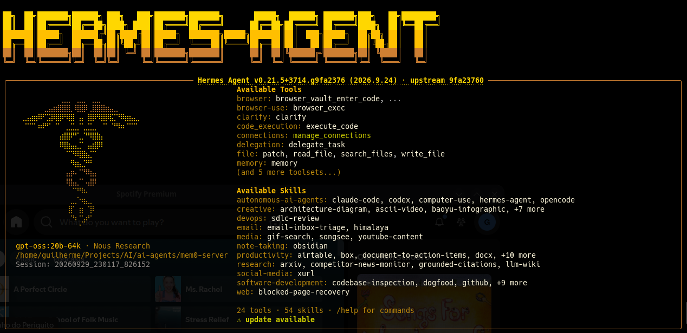

# AI Services Reinstall Guide

Step-by-step guide to reinstall all AI-related services on a fresh Ubuntu setup.

## Table of Contents

- [Hardware Reference](#hardware-reference) — machine specs, disk layout
- [0. Before You Start](#0-before-you-start) — git setup, cloning this repo, what is *not* in the repo (data, secrets)
- [1. NVIDIA Driver & CUDA Setup](#1-nvidia-driver--cuda-setup) — driver install, `nvidia-smi`, optional CUDA Toolkit
- [2. Ollama Installation](#2-ollama-installation) — install, model storage path, model list, global setting `OLLAMA_MAX_LOADED_MODELS`, 64K context variants (Modelfiles)
- [3. Open WebUI (Docker)](#3-open-webui-docker) — Docker install, container, restart policy, LAN/remote access, users
- [4. Post-Install Checklist](#4-post-install-checklist) — verification for the base stack and the agents stack
- [5. Mem0 — Agent Memory Layer](#5-mem0--agent-memory-layer-venv-graph-memory) — venv, Neo4j + APOC, embeddings model, `.env`, `config.py`, test
- [6. Git — `~/Projects/AI` repo](#6-git--projectsai-repo) — `.gitignore`, nested repos
- [7. CrewAI ↔ Mem0 Integration](#7-crewai--mem0-integration-venv-manual-tool) — Python 3.12 venv, dependencies and pins, integration script, troubleshooting
- [8. Paperclip Agent Manager](#8-paperclip-agent-manager-docker) — clone, `.env` secret, Docker Compose, restart policy, first login, verify, updating
- [9. Hermes Agent](#9-hermes-agent-orchestrator-for-the-crewai-team) — official installer, model choice (`gpt-oss:20b`), 64K variants, wizard choices, config fixes, validation tests, troubleshooting, first-install history (9.12)
- [Pending / To Investigate](#pending--to-investigate) — open items
- [Notes](#notes) — cross-cutting reminders

## Hardware Reference

| Component   | Spec                                                                   |
| ----------- | ---------------------------------------------------------------------- |
| CPU         | AMD Ryzen 9 5950X                                                      |
| RAM         | 32GB 3600MHz                                                           |
| GPU         | GeForce RTX 4080 SUPER 16GB                                            |
| Motherboard | Aorus X570 Elite                                                       |
| OS Drive    | Samsung SSD 990 PRO 2TB (500GB Ubuntu / 1.3TB Windows / 200GB Bazzite) |

> This guide targets the **Ubuntu** partition (500GB). Ubuntu 26.04 LTS ("resolute") ships only Python 3.14 by default — see Section 7.1 for why a second Python version is needed for CrewAI.

---

## 0. Before You Start

### 0.1 Clone this repo

The scripts and config files referenced in this guide (e.g. `ai-agents/mem0/config.py`, `ai-agents/crewai/crewai_mem0_example.py`) live in this repo. On a fresh install, clone it first:

```
sudo apt install git
git config --global user.name "Your Name"
git config --global user.email "you@example.com"
mkdir -p ~/Projects
git clone https://github.com/rizzo9555/AI.git ~/Projects/AI
```

### 0.2 What is *not* in this repo

By design (see `.gitignore`, Section 6), the repo holds no data and no secrets. These must be backed up **before** wiping the Ubuntu partition, and restored afterwards:

- Open WebUI data — Docker volume `open-webui` (users, chats, settings)
- Mem0 memories — `ai-agents/mem0/neo4j/data/` (Neo4j) and `ai-agents/mem0/qdrant_data/` (Qdrant)
- Paperclip data — `ai-agents/paperclip/data/`
- Hermes Agent config/data — `~/.hermes/` (`config.yaml`, `.env`, sessions, memories); outside the repo by design (Section 9.1)
- Every `.env` file (Neo4j password, Paperclip's `BETTER_AUTH_SECRET`) — also keep these values in a password manager
- Optional: Ollama models (`/usr/share/ollama/.ollama/models`, ~110GB) — re-downloadable, just slow

> The backup/restore procedure itself isn't written yet — see Pending.

---

## 1. NVIDIA Driver & CUDA Setup

Install the latest recommended NVIDIA driver:

```
sudo apt update
sudo ubuntu-drivers install
sudo reboot
```
> `ubuntu-drivers install` is the current form of the older `ubuntu-drivers autoinstall` (deprecated alias, same result).

Verify the driver installation:

```
nvidia-smi
```

### Optional: CUDA Toolkit

**Not needed by anything in this guide** — Ollama ships its own CUDA runtime libraries, and nothing here compiles CUDA code. Only install it if a future tool needs `nvcc`. If so, follow NVIDIA's instructions (https://developer.nvidia.com/cuda-downloads) but install only the **`cuda-toolkit`** package — not the `cuda` meta-package, which also installs NVIDIA's own driver and can conflict with the one installed by `ubuntu-drivers` above.

Verify:

```
nvcc --version
```

---

## 2. Ollama Installation

Install Ollama:

```
curl -fsSL https://ollama.com/install.sh | sh
```

Verify the service is running:

```
systemctl status ollama
```

### 2.1 Model Storage Location

Models downloaded via `ollama pull` are stored at:

```
/usr/share/ollama/.ollama/models
```

### 2.2 Reinstalling Models

Pull each model back down:

```
ollama pull qwen3-coder:30b
ollama pull qwen3.8:27b
ollama pull qwen2.5-coder:14b
ollama pull gpt-oss:20b
ollama pull deepseek-r1:14b
ollama pull gemma4:26b
ollama pull gemma4:12b
ollama pull qwen3:14b
ollama pull nomic-embed-text   # embeddings model required by Mem0 (Section 5.3)
```

Plus one model pulled via Hugging Face GGUF instead of the Ollama library. **Currently unused** — it was the orchestrator of the first (reverted) Hermes Agent install, and it **can't be used with Hermes Agent anymore**: its Qwen3 base caps context at 40,960 tokens, below Hermes's 64K minimum (Section 9.2). Still installed as of 2026-09-27; removal pending. On a reinstall, skip it:

```
ollama pull hf.co/bartowski/NousResearch_Hermes-4-14B-GGUF:Q4_K_M
```

Verify installed models:

```
ollama list
```

Expected: **10 models** (9 from the Ollama library + the Hermes GGUF), plus the **2 `-64k` variants** once Section 2.4 is done — 12 entries total.

### 2.3 Global Setting: `OLLAMA_MAX_LOADED_MODELS=1`

Keeps only one model resident in VRAM at a time, so the 16GB GPU is never shared by two models (which would either exhaust VRAM or push inference onto the much slower CPU). Ollama still loads/unloads models automatically per request. First introduced during the first Hermes Agent setup, but it's global — it applies to every section of this guide and was kept after the Hermes uninstall.

```
sudo mkdir -p /etc/systemd/system/ollama.service.d
sudo tee /etc/systemd/system/ollama.service.d/override.conf > /dev/null << 'EOF'
[Service]
Environment="OLLAMA_MAX_LOADED_MODELS=1"
EOF
sudo systemctl daemon-reload
sudo systemctl restart ollama
```

Verify it took effect (output should include `OLLAMA_MAX_LOADED_MODELS=1`):

```
systemctl show ollama --property=Environment --no-pager
```

(`--no-pager` prints the full line; without it, long output gets cut at the screen edge.)
> `tee` **overwrites** the whole `override.conf`. If more Ollama variables are added later, put them all in this same file, one `Environment=` line each.
> Trade-off to watch: Mem0 (Sections 5 and 7) uses `nomic-embed-text` for embeddings and `qwen3:14b` for reasoning, so under this limit Ollama swaps them in and out of VRAM on every memory search/add. See Pending.

### 2.4 64K Context Variants (Modelfiles)

Some tools (Hermes Agent, Section 9) talk to Ollama through its OpenAI-compatible `/v1` endpoint, which **ignores per-request context size** (`num_ctx`) — the model silently loads at Ollama's default (4096), even if the tool displays a bigger number. The fix is a model *variant* with the context baked in via a Modelfile. Variants reuse the base model's files (no extra disk space) and don't affect other apps (Open WebUI, Mem0), which keep using the base models.

The Modelfiles are versioned in this repo at `~/Projects/AI/modelfiles/`. Recreate the variants after Section 2.2 (terminal, no venv needed):

```
ollama create gpt-oss:20b-64k -f ~/Projects/AI/modelfiles/gpt-oss-20b-64k.Modelfile
ollama create gemma4:12b-64k -f ~/Projects/AI/modelfiles/gemma4-12b-64k.Modelfile
```

Each Modelfile is just two lines, e.g.:

```
FROM gpt-oss:20b
PARAMETER num_ctx 65536
```

Verify the real loaded context (column `CONTEXT` should read `65536`):

```
ollama run gpt-oss:20b-64k "responda só: ok"
ollama ps
```

> Ollama **caps** `num_ctx` at the model's trained maximum — a variant can't push a model past its native context. E.g. `qwen3:14b` stays at 40,960 even with `num_ctx 65536` (verified with `ollama ps`). Check a model's native maximum with `ollama show <model>` (line `context length`).

---

## 3. Open WebUI (Docker)

> **Why Ollama stays native and isn't dockerized:** with a dedicated NVIDIA GPU, native Ollama uses the system driver directly with zero extra config. Dockerizing it would require installing and maintaining the NVIDIA Container Toolkit just for GPU passthrough, with no real benefit on a single-machine setup. Open WebUI itself doesn't touch the GPU (it's just the web interface), so only it needs to be containerized — the NVIDIA Container Toolkit step is skipped entirely.

### 3.1 Install Docker

Using Docker's official install script (simpler than the manual apt-repository method, works across distros):

```
curl -fsSL https://get.docker.com -o get-docker.sh
sudo sh get-docker.sh
```

Allow running Docker without `sudo` (optional but recommended):

```
sudo usermod -aG docker $USER
```
> Log out and back in (or restart the terminal/session) for the group change to take effect.

Confirm the Docker service is running and enabled to start on boot:

```
sudo systemctl status docker
sudo systemctl is-enabled docker   # should say "enabled"; if not: sudo systemctl enable docker
```

Verify Docker:

```
docker run hello-world
```

### 3.2 Run Open WebUI

Since Ollama runs natively (not in Docker), Open WebUI is run with `--network=host` so the container shares the host's network stack and can reach Ollama directly at `127.0.0.1:11434` — no port mapping or `host.docker.internal` needed on Linux.

```
docker run -d \
  --name open-webui \
  --network=host \
  -v open-webui:/app/backend/data \
  -e OLLAMA_BASE_URL=http://127.0.0.1:11434 \
  --restart unless-stopped \
  ghcr.io/open-webui/open-webui:main
```

Access the interface at:

```
http://localhost:8080
```
> Note: `--network=host` is Linux-specific and is why the port is 8080 directly (no `-p` mapping) rather than remapped to 3000 as on Mac/Windows setups.
> **Restart policy — standard for every container in this guide: `unless-stopped`.** The container comes back after a crash or a reboot, but stays down after a manual `docker stop`. (`always` would bring it back on the next Docker/machine restart even after a manual stop.) Standardized on 2026-09-27; an existing container can be switched without recreating it: `docker update --restart unless-stopped open-webui`.

### 3.3 Verify

```
docker ps
docker logs open-webui
```

### 3.4 LAN Access (other devices at home)

Find the machine's local IP:

```
ip addr show | grep "inet " | grep -v 127.0.0.1
```

From another device on the same network, open `http://<LOCAL_IP>:8080`. If it doesn't connect, check the firewall:

```
sudo ufw status
sudo ufw allow 8080/tcp   # if ufw is active and the port isn't allowed
```
> Consider setting a DHCP reservation for this machine on the router so the local IP doesn't change on reboot.
> **ufw only governs Open WebUI here because it uses the host network.** Containers that publish ports with `-p` (Neo4j, Paperclip) bypass ufw entirely — Docker writes its own iptables rules — which is why Neo4j is bound to `127.0.0.1` in Section 5.2.

### 3.5 Remote Access (internet)

Not yet configured. Preferred approach when needed: a VPN (e.g. Tailscale) rather than a public reverse proxy — no ports exposed to the internet, simplest to set up for personal use.

### 3.6 First Login & Users

The first account created at `http://localhost:8080` becomes the admin automatically. Additional users (e.g. family members) are added manually via *Admin Panel → Users → Add User*. The "email" field is required as a login identifier but doesn't need to be a real, working address (e.g. `name@family.local` works fine — nothing is sent to it).

---

## 4. Post-Install Checklist

**Base stack (Sections 1–3):**

- [ ] `nvidia-smi` shows the RTX 4080 SUPER correctly
- [ ] `ollama list` shows all 10 models (Section 2.2) plus the 2 `-64k` variants (Section 2.4)
- [ ] `systemctl show ollama --property=Environment --no-pager` includes `OLLAMA_MAX_LOADED_MODELS=1` (Section 2.3)
- [ ] `sudo systemctl is-enabled docker` returns `enabled`
- [ ] Open WebUI loads at `http://localhost:8080`
- [ ] Open WebUI can see and query the Ollama models
- [ ] GPU usage confirmed during inference (`nvidia-smi` while running a prompt)
- [ ] Open WebUI reachable from another device via `http://<LOCAL_IP>:8080`
- [ ] Admin account created; additional family user accounts added

**Agents stack (Sections 5–9)** — check after finishing those sections:

- [ ] Neo4j Browser loads at `http://localhost:7474`, and the Section 5.6 test prints the stored memory (`venv-mem0` active)
- [ ] `crewai_mem0_example.py` completes both rounds (Section 7.3, CrewAI `venv` active)
- [ ] Paperclip loads at `http://localhost:3100`, and the checks in Section 8.6 print `ENV OK` and `SECRET MATCHES`
- [ ] Hermes Agent: `hermes doctor` shows no `✗` lines, and the 4 tests in Section 9.10 pass (basic chat, `-c 65536` in the Ollama logs, tool calling, vision)
- [ ] Every container uses the `unless-stopped` restart policy:

```
docker inspect -f '{{.Name}} {{.HostConfig.RestartPolicy.Name}}' open-webui neo4j-mem0 docker-paperclip-1
```

---

## 5. Mem0 — Agent Memory Layer (venv, Graph Memory)

Gives agents (starting with CrewAI) persistent memory: a vector store (Qdrant, embedded/local) for semantic recall plus a graph store (Neo4j) for entity/relationship memory. Runs as a Python library inside a dedicated venv — not the official Docker server bundle, since that bundle only supports OpenAI/Anthropic/Gemini out of the box (see Pending list below). Fully local via Ollama.

### 5.1 Create the venv and install Mem0

```
mkdir -p ~/Projects/AI/ai-agents/mem0 && cd ~/Projects/AI/ai-agents/mem0
python3 -m venv venv-mem0
source venv-mem0/bin/activate
pip install mem0ai ollama neo4j langchain-neo4j python-dotenv
```
> Note: as of `mem0ai` 2.2.0, the `[graph]` install extra was dropped — the `neo4j`/`langchain-neo4j` packages must be installed manually, as above. The `ollama` package (official Python client) is also required separately for the Ollama embedder to work.
> **Watch out — `mem0ai[extras]` is not for fastembed/BM25.** It's a bundle for cloud vector-store integrations (AWS Bedrock, OpenSearch, Elasticsearch) and pulls in `boto3`, `elasticsearch`, `opensearch-py`, plus older `langchain`/`langchain-community` packages. If `langgraph`/`langchain-neo4j` are installed in the same venv, this downgrades `langchain-core` and breaks them. For BM25 keyword search, install `fastembed` directly instead — see Section 7.2.1.
> **Version drift (pending):** this venv installs `mem0ai` unpinned (2.2.0 as of 2026-09-27), while the CrewAI venv pins `2.0.14` (Section 7.2) — and both read/write the same Qdrant and Neo4j data. Works so far; aligning them is listed under Pending.

### 5.2 Run Neo4j locally (Docker, with APOC plugin)

Graph Memory requires the **APOC** plugin enabled:

```
mkdir -p ~/Projects/AI/ai-agents/mem0/neo4j/data ~/Projects/AI/ai-agents/mem0/neo4j/plugins

docker run -d \
  --name neo4j-mem0 \
  -p 127.0.0.1:7474:7474 -p 127.0.0.1:7687:7687 \
  -v ~/Projects/AI/ai-agents/mem0/neo4j/data:/data \
  -v ~/Projects/AI/ai-agents/mem0/neo4j/plugins:/plugins \
  -e NEO4J_AUTH=neo4j/CHANGE_ME_ON_FIRST_BOOT \
  -e NEO4J_apoc_export_file_enabled=true \
  -e NEO4J_apoc_import_file_enabled=true \
  -e NEO4J_apoc_import_file_use__neo4j__config=true \
  -e NEO4J_PLUGINS='["apoc"]' \
  --restart unless-stopped \
  neo4j:2026.09.0
```

- Port `7474`: Neo4j Browser (`http://localhost:7474`)
- Port `7687`: Bolt protocol (used by Mem0 to connect)
- `NEO4J_AUTH` only sets the password on **first boot of an empty data volume**. To change the password later without losing data, log into the Browser and run: `ALTER CURRENT USER SET PASSWORD FROM 'old' TO 'new';`
- `127.0.0.1:` in front of each port — only this machine can reach Neo4j. Mem0 connects via `localhost`, so nothing changes for it. Without the prefix, Docker opens the ports to the whole LAN regardless of ufw (see 3.4).
- `NEO4J_PLUGINS` — current variable name. The older `NEO4JLABS_PLUGINS` (Neo4j 4.x) still works but logs a rename warning on every start.
- `neo4j:2026.09.0` — pinned to the version in use as of 2026-09-27 (`docker exec neo4j-mem0 neo4j --version`) instead of `latest`, so a reinstall doesn't silently jump to a newer release. Upgrade deliberately.

> The container currently running was created with the earlier flags (`NEO4JLABS_PLUGINS`, ports on all interfaces, `neo4j:latest`; restart policy later switched to `unless-stopped` via `docker update`). Recreating it with the command above is listed under Pending — the data is safe either way, since it lives in the bind-mounted `neo4j/data` folder.

### 5.3 Ollama models required

```
ollama pull nomic-embed-text
```

(Reuses an existing chat/reasoning model, e.g. `qwen3:14b`, for entity/fact extraction — no separate pull needed.)

### 5.4 Secrets — `.env`

Create `~/Projects/AI/ai-agents/mem0/.env` (gitignored — see Section 6):

```
NEO4J_PASSWORD=your_real_password_here
```

Keep a `.env.example` (no real value, safe to commit) alongside it:

```
NEO4J_PASSWORD=
```

### 5.5 `config.py`

```
import os
from dotenv import load_dotenv
from mem0 import Memory

load_dotenv()

config = {
    "llm": {
        "provider": "ollama",
        "config": {
            "model": "qwen3:14b",
            "ollama_base_url": "http://localhost:11434"
        }
    },
    "embedder": {
        "provider": "ollama",
        "config": {
            "model": "nomic-embed-text",
            "ollama_base_url": "http://localhost:11434"
        }
    },
    "vector_store": {
        "provider": "qdrant",
        "config": {
            "collection_name": "mem0_memories",
            "embedding_model_dims": 768,
            "path": "/home/guilherme/Projects/AI/ai-agents/mem0/qdrant_data"
        }
    },
    "graph_store": {
        "provider": "neo4j",
        "config": {
            "url": "bolt://localhost:7687",
            "username": "neo4j",
            "password": os.getenv("NEO4J_PASSWORD"),
            "database": "neo4j"
        }
    },
    "version": "v1.1"
}

memory = Memory.from_config(config_dict=config)
```
> `embedding_model_dims: 768` matches `nomic-embed-text`'s output size — Mem0's Qdrant default (1536) is sized for OpenAI embeddings and must be overridden or `add`/`search` will fail with a dimension mismatch.
> **Important — Qdrant is running in local/embedded mode, not as a server.** Because `vector_store.config` uses `path` (not `host`/`port`), Qdrant has no separate process — it's a set of files on disk that Python opens directly. This means **only one process can have it open at a time**. Don't run a Mem0 standalone script and the CrewAI integration (Section 7) at the same time — one will fail to open the locked files.

### 5.6 Test

```
# test_mem0.py
from config import memory

conversation = [
    {"role": "user", "content": "Uso Ollama local com uma RTX 4080 Super de 16GB."},
    {"role": "assistant", "content": "Entendido, vou lembrar disso."}
]

memory.add(conversation, user_id="rizzo")

results = memory.search(
    "Qual GPU eu uso?",
    filters={"user_id": "rizzo"},
    limit=3
)
for hit in results["results"]:
    print(hit["memory"])
```

```
python test_mem0.py
```

Verify the graph side by opening `http://localhost:7474` and running `MATCH (n) RETURN n LIMIT 25;` — connected nodes confirm Graph Memory is writing correctly.
> Note: `search()`/`get_all()` require `user_id` inside `filters={}` — passing it as a top-level kwarg (as `add()`/`delete_all()` still accept) raises a `ValueError` on current versions. This applies across `mem0ai` 2.x releases, at least down to `2.0.14`.

---

## 6. Git — `~/Projects/AI` repo

`~/Projects/AI` is a git repository (cloned in Section 0.1). Its root `.gitignore` contains:

```
# Python virtual environments
**/venv*/
__pycache__/
*.pyc

# Local databases (data, not source)
ai-agents/mem0/neo4j/data/
ai-agents/mem0/neo4j/plugins/
ai-agents/mem0/qdrant_data/

# Nested git repos (Paperclip and Hermes Agent are each cloned from their own
# upstream repo — see Sections 8 and 9)
ai-agents/paperclip/
ai-agents/hermes-agent/

# Secrets
.env
```
> **Nested repo note:** `ai-agents/paperclip/` and `ai-agents/hermes-agent/` are each a git clone of their own upstream repo, with their own `.git`. The lines above stop the main `~/Projects/AI` repo from tracking either at all. Paperclip's own upstream `.gitignore` also already ignores its `.env` and `data/`, so neither can be committed by accident from inside that repo either. Hermes Agent doesn't have this issue — its config/secrets live entirely outside the repo, at `~/.hermes` (Section 9.1).
> Fixed 2026-09-27: the committed `.gitignore` used to contain the literal `cat > … << 'EOF'` and `EOF` lines of the heredoc command that was meant to *create* it. The heredoc is a terminal command — only the lines between those two markers belong in the file.

---

## 7. CrewAI ↔ Mem0 Integration (venv, manual tool)

Gives a CrewAI agent access to the Mem0 memory set up in Section 5, so it can recall facts/preferences across runs. **CrewAI has no built-in native support for a `"provider": "mem0"` memory backend** — confirmed by grepping the entire installed `crewai`/`crewai-core` source (version 1.15.22) for the string `"mem0"`: zero matches outside the `mem0` package itself. A `memory_config={"provider": "mem0", ...}` is silently ignored by this CrewAI version; it falls back to its own default (ChromaDB-based) memory, which then fails due to the `posthog`/`chromadb` version conflict noted in 7.4. Integration here is done manually instead, via a custom Tool.

### 7.1 Create the venv (separate from Mem0's) with Python 3.12

Ubuntu 26.04 ships only Python 3.14 by default, which lacks pre-built wheels for several CrewAI dependencies (e.g. `tiktoken`, which requires a Rust compiler to build from source on 3.14). Python 3.12 is used instead, installed via the Deadsnakes PPA:

```
sudo apt install software-properties-common
sudo add-apt-repository ppa:deadsnakes/ppa -y
sudo apt update
sudo apt install python3.12 python3.12-venv
```

Then create the venv:

```
mkdir -p ~/Projects/AI/ai-agents/crewai && cd ~/Projects/AI/ai-agents/crewai
python3.12 -m venv venv
source venv/bin/activate
```

### 7.2 Install dependencies

Install in separate steps (installing everything in one `pip install` line can trigger a `resolution-too-deep` error — CrewAI's dependency tree, combined with `langchain-neo4j`, is too complex for pip to solve in one pass):

```
pip install --upgrade pip setuptools wheel
pip install crewai
pip install mem0ai==2.0.14
pip install python-dotenv
pip install neo4j
pip install langchain-neo4j
```
> `mem0ai` is pinned to `2.0.14` here for stability, though this pin turned out not to be the fix for the integration issue (see 7.4) — the `mem0` library itself works fine with any recent 2.x version, as long as `search()`/`get_all()` calls use `filters={"user_id": ...}` (see Section 5.6's note).

`mem0ai` also requires its own `.env` with `NEO4J_PASSWORD` — same value as Section 5.4, copy `~/Projects/AI/ai-agents/mem0/.env` or create a fresh one in the `crewai` folder. A `.env.example` (no real value) is committed in the `crewai` folder as a template.

`crewai` installs `chromadb`, which pins `posthog<6.0.0`; `mem0ai` has no upper bound on `posthog` and pulls the latest (7.x) by default. Pin it down explicitly after installing both:

```
pip install "posthog<6.0.0"
```

This leaves a cosmetic `pip check` warning (`mem0ai requires posthog>=7.14.0, but you have posthog 5.4.0`) — see 7.4 for why this is safe to ignore.

#### 7.2.1 Optional extras: spaCy (entity extraction) + fastembed (BM25 keyword search)

```
pip install "mem0ai[nlp]==2.0.14"
pip install fastembed
```
> Same `mem0ai` pin as in 7.2 — keeps pip from switching the version while adding the extra.

Both models download automatically on first use — no manual `spacy download` step needed: the `en_core_web_sm` spaCy model downloads the first time a tool call triggers entity extraction, and the fastembed BM25 model downloads on the first search. Confirmed working end-to-end (Section 7.3's script).
> Do **not** run `pip install "mem0ai[extras]"` for this — see the warning in Section 5.1. If it's already been run by mistake, recover with:
>
> ```
> pip uninstall -y langchain langchain-community elasticsearch elastic-transport opensearch-py opensearch-protobufs boto3 botocore s3transfer
> pip install --upgrade "langchain-core>=1.4.7,<2" "langchain-text-splitters>=1.1.2,<2" "posthog<6.0.0"
> ```

### 7.3 The integration script

`~/Projects/AI/ai-agents/crewai/crewai_mem0_example.py` — a minimal working example. Key points:

- `memory=False` on the `Crew` — disables CrewAI's own (broken) default memory system.
- A custom `BaseTool` (`buscar_memoria`) that the agent calls explicitly to search Mem0 (`mem0_client.search(query, filters={"user_id": USER_ID}, limit=5)`).
- A `salvar_memoria()` helper function, called manually after each `crew.kickoff()`, that writes the turn to Mem0 (`mem0_client.add(..., user_id=USER_ID)`).
- The agent's LLM must be set **explicitly** to Ollama — `memory_config`/Mem0 setup has no effect on which LLM the *agent* itself uses to reason. Without this, CrewAI defaults to OpenAI and fails with `OPENAI_API_KEY is required`:

```
from crewai import LLM
ollama_llm = LLM(model="ollama/qwen3:14b", base_url="http://localhost:11434")
# ...
agent = Agent(..., llm=ollama_llm, tools=[BuscarMemoriaTool()])
```

The full script is committed in this repo at `ai-agents/crewai/crewai_mem0_example.py`.

### 7.4 Troubleshooting notes (from setting this up)

- **`resolution-too-deep` on `pip install`**: install packages one at a time (Section 7.2), not all in one command.
- **`tiktoken` build fails needing a Rust compiler**: symptom of running on Python 3.14; switch to 3.12 (Section 7.1) rather than installing Rust.
- **Duplicated `(venv)` in the shell prompt** (e.g. `((venv) )`, `(venv) (venv)`): a known quirk when a venv is activated on top of another already-active one, or after a broken attempt to customize `PS1`. It's purely cosmetic (confirmed via `$VIRTUAL_ENV` and `which python3` — the correct interpreter is always used), but if it's distracting, the reliable fix is closing the terminal application entirely and opening a new one, then activating the venv once.
- **`OPENAI_API_KEY is required`**: the agent's `llm=` wasn't set explicitly — see Section 7.3.
- **`chromadb` requires `posthog<6.0.0`, but `mem0ai` requires `posthog>=7.14.0`**: a real conflict between CrewAI's `chromadb` dependency and `mem0ai`'s declared metadata — the two ranges don't overlap, so no single `posthog` version satisfies both `pip check`. Resolved by pinning `posthog<6.0.0` (Section 7.2), which leaves a residual `pip check` warning from `mem0ai`'s side. This is safe in practice: both packages only use `posthog` for anonymous telemetry (simple `capture()` calls), an API that's been stable across major versions, and this was confirmed by running the integration script (Section 7.3) end-to-end with `posthog` 5.4.0 — `add()` and `search()` both worked with no exceptions. The theoretical risk is a future `mem0ai` release calling a `posthog` 7.x-only feature outside the paths already tested here; if that ever surfaces, the more robust fix is disabling Mem0's telemetry entirely (`MEM0_TELEMETRY=false` in `.env`), which removes the dependency on `posthog`'s version for `mem0ai`'s side — not applied yet, listed under Pending.
- **`mem0ai[extras]` breaks `langchain-core`/`langgraph`**: see the warning in Section 5.1 and the recovery command in 7.2.1. Installing `mem0ai[extras]` for BM25 support is the wrong flag — it's meant for AWS/OpenSearch/Elasticsearch integrations — and pulls an old `langchain`/`langchain-community` that downgrades `langchain-core`, breaking anything in the venv that needs `langchain-core>=1.x` (`langgraph`, `langchain-neo4j`, `langchain-classic`, `langgraph-sdk`, `langgraph-prebuilt`).
- **`memory_save_failed` warning with "empty scope stack"**: misleading — this came from CrewAI's default (ChromaDB) memory failing silently in the background (see `posthog` conflict above), not from Mem0. It disappeared once `memory=False` + the manual tool approach (Section 7.3) replaced the native `memory_config`.
- **Qdrant appears to not be running (`docker ps` doesn't show it, nothing on port 6333)**: expected — it's running in local/embedded mode (Section 5.6), not as a server.

---

## 8. Paperclip Agent Manager (Docker)


Open-source orchestration platform ([paperclipai/paperclip](https://github.com/paperclipai/paperclip)) that manages a team of AI agents (CrewAI, Claude Code, Codex, etc.) like employees in a company — org chart, tickets, budgets, governance. Will also be used in the future "Get Contractors Now" project.
> **Why Docker and not native (Node/pnpm):** Paperclip doesn't touch the GPU, so the reason Ollama stays native doesn't apply here. Docker was chosen for isolation and portability, matching the Open WebUI approach — the official install path builds the image locally from source (no pre-built image to just pull), so the repo still needs to be cloned either way.

### 8.1 Clone the repo

```
cd ~/Projects/AI/ai-agents
git clone https://github.com/paperclipai/paperclip.git
cd paperclip
```

This creates a **nested git repo** inside `~/Projects/AI` — see the `.gitignore` note in Section 6.

### 8.2 Create `.env` with the auth secret

`BETTER_AUTH_SECRET` (session/auth signing key) is required — the quickstart compose file refuses to start without it. Generate it once and keep it in `.env` at the repo root:

```
cd ~/Projects/AI/ai-agents/paperclip
echo "BETTER_AUTH_SECRET=$(openssl rand -hex 32)" > .env
```

- On a reinstall, restore the **old** value from backup instead of generating a new one — a new secret at least invalidates every existing login session.
- `.env` is already ignored by Paperclip's own upstream `.gitignore`, and the outer repo ignores the whole folder (Section 6).

> History: the current install (2026-09-25) passed the secret inline on the first `docker compose up` and saved it to `.env` afterwards, reading it back with `docker exec docker-paperclip-1 env | grep BETTER_AUTH_SECRET`. Same end result.

### 8.3 Run via Docker Compose (official quickstart)

```
cd ~/Projects/AI/ai-agents/paperclip
docker compose --env-file .env -f docker/docker-compose.quickstart.yml up -d
```

- **`--env-file .env` is required.** With `-f docker/...`, Compose looks for `.env` in the compose file's own folder (`docker/`), not in the current folder — without the flag it fails with `required variable BETTER_AUTH_SECRET is missing a value` (confirmed 2026-09-27).
- First run builds the image from the repo's `Dockerfile` (slower); later runs reuse the built image (see 8.7 for updates).
- Persistent data (embedded PostgreSQL, uploads, secrets key, agent workspace data) lives under `data/docker-paperclip/` at the repo root — the compose file's default `../data/docker-paperclip`, resolved from `docker/`. Ignored by upstream's `.gitignore` (`data/`) and by the outer repo (Section 6).
- Access at `http://localhost:3100`.
- Port 3100 is published on all interfaces, so it's open to the LAN regardless of ufw (see 3.4). Paperclip itself still rejects hostnames other than `localhost` until LAN access is configured (see Pending).

> **Container name:** Compose names it `docker-paperclip-1` (derived from the compose file's folder, `docker`, + the service name), **not** `paperclip`. Use the real name for `docker exec`/`docker update` below — check with `docker ps` if unsure.

### 8.4 Keep it always running (survive reboots)

```
docker update --restart unless-stopped docker-paperclip-1
```

Same policy as every container in this guide (see 3.2): restarts automatically after a crash or a reboot; only a manual `docker stop docker-paperclip-1` keeps it down.

> The quickstart compose file has no `restart:` key, so this setting is **lost whenever Compose recreates the container** (e.g. after an update, 8.7). Re-run the command above after every recreate.

### 8.5 First login

Open `http://localhost:3100`. The first account created on the setup screen automatically becomes the instance admin — same as Open WebUI (Section 3.6), the email field doesn't need to be real (no SMTP is configured, so nothing is sent/verified). **Done** — admin account created.

### 8.6 Verify

```
cd ~/Projects/AI/ai-agents/paperclip
docker ps                                   # confirms docker-paperclip-1 is Up
docker compose --env-file .env -f docker/docker-compose.quickstart.yml config > /dev/null && echo "ENV OK"
diff <(grep BETTER_AUTH_SECRET .env) <(docker exec docker-paperclip-1 env | grep BETTER_AUTH_SECRET) > /dev/null && echo "SECRET MATCHES" || echo "SECRET DIFFERS"
```

The last two lines check the setup without printing the secret: `ENV OK` means Compose can read `.env`; `SECRET MATCHES` means `.env` holds the same value the running container uses.

### 8.7 Updating Paperclip

> Not yet exercised on this install.

```
cd ~/Projects/AI/ai-agents/paperclip
git pull
docker compose --env-file .env -f docker/docker-compose.quickstart.yml up -d --build
docker update --restart unless-stopped docker-paperclip-1
```

`--build` forces a rebuild of the image from the updated source — without it, Compose keeps using the old image. The last line restores the restart policy (see 8.4).

---

## 9. Hermes Agent (Orchestrator for the CrewAI Team)



Autonomous agent framework from Nous Research ([hermes-agent.nousresearch.com](https://hermes-agent.nousresearch.com)), used to orchestrate/delegate work to the CrewAI team (Section 7), particularly for the future "Get Contractors Now" project. Fully local via Ollama, same as everything else in this stack.

> **✅ Status (2026-09-27): reinstalled from scratch and validated** — tool calling and vision both working. A first install earlier the same day was fully reverted after validation problems; that history is condensed in Section 9.12.

**Summary of the working setup:**

| Role | Model | Measured (`ollama ps`) |
|---|---|---|
| Orchestrator (main model) | `gpt-oss:20b-64k` | 12 GB, 100% GPU, context 65,536 |
| Vision (auxiliary) | `gemma4:12b-64k` | 8.5 GB, 100% GPU, context 65,536 |

### 9.1 Install (official installer)

Terminal, no venv needed. Code goes inside the project folder (convention); config/secrets/sessions stay at the default `~/.hermes`:

```
cd ~/Projects/AI
curl -fsSL https://hermes-agent.nousresearch.com/install.sh | bash -s -- --dir ~/Projects/AI/ai-agents/hermes-agent
```

- `bash -s --` is required to pass flags through `curl | bash`. Without `--dir`, the installer defaults to `~/.hermes/hermes-agent`.
- The installer provisions its own Python runtime/venv under `~/.hermes/installs/...` (Python 3.14 as of this install) and puts `hermes` in `~/.local/bin` — no manual venv activation ever needed to run `hermes`.
- Without `--skip-setup`, it goes straight into the setup wizard at the end (Section 9.4).

### 9.2 Model choice — why `gpt-oss:20b`

Hermes Agent **hard-requires ≥ 64,000 tokens of context**, and (current versions) checks the context Ollama *actually loaded*, not just the configured value. That rules out every Qwen3-based ~14B model:

| Candidate | Native context | Result |
|---|---|---|
| `qwen3:14b` | 40,960 | ❌ Ollama caps at 40,960 even with a 64K Modelfile; and at 40,960 it already spills to CPU (16 GB, 12%/88% CPU/GPU) |
| Hermes-4-14B (hf.co GGUF) | 40,960 (Qwen3 base) | ❌ same ceiling — no longer an option regardless of bug #110442 (Section 9.12) |
| `gemma4:12b` | 262,144 | Fits (8.5 GB @ 64K, 100% GPU) but **failed as orchestrator**: test 1 — tool command failed, then it *invented* the result; test 2 — no tool call at all, returned a blank template with a leaked `<channel|>` token (its native tool-call format not recognized through Ollama `/v1` → Hermes). Fine as a **vision** model. |
| `gpt-oss:20b` | 131,072 | ✅ **Chosen.** MoE (21B total, ~3.6B active per token → fast), trained for tool use. 12 GB @ 64K, 100% GPU. Correct tool calls, no loop, and it cross-checks tool output instead of blindly repeating it. |

Exception to the "~14B for daily use" rule: `gpt-oss:20b` is justified by its MoE design (small active size) and because it fits fully in VRAM at 64K.

### 9.3 Create the 64K variants (before the wizard)

See Section 2.4 — the `/v1` endpoint Hermes uses ignores per-request context, so the models must be `-64k` variants:

```
ollama create gpt-oss:20b-64k -f ~/Projects/AI/modelfiles/gpt-oss-20b-64k.Modelfile
ollama create gemma4:12b-64k -f ~/Projects/AI/modelfiles/gemma4-12b-64k.Modelfile
```

### 9.4 Setup wizard — key choices

Navigate only with arrows / Enter / Space / Esc — **never Ctrl+C** (Section 9.11).

| Prompt | Choice | Why |
|---|---|---|
| Setup mode | **Full setup** | "Quick Setup" logs into the Nous Portal cloud |
| Provider | **Custom endpoint (enter URL manually)** | Near the bottom of the list. Not "custom (direct API)" |
| API base URL | `http://localhost:11434/v1` | Ollama's OpenAI-compatible endpoint |
| API key | blank (Enter) | Marked optional; not needed locally |
| API compatibility mode | **2 — Chat Completions** | Skips Auto-detect's probing of Ollama-native routes (known source of silent hangs) |
| Model | any from the list | Will be switched to `gpt-oss:20b-64k` afterwards (9.7) — the wizard only lists what's installed at that moment |
| Context length | `65536` | Hermes's 64K minimum |
| Display name | default (`Local (localhost:11434)`) | Cosmetic |
| Reasoning effort | `medium` | Changeable per session with `/reasoning` |
| Terminal backend | **Keep current (local)** | Same machine |
| Messaging platforms | none (Enter with nothing checked) | Can be added later: `hermes setup gateway` |
| Tools (CLI) | see 9.5 | |
| Browser provider | **Local Browser** | Headless Chromium, free |
| Vision backend | Pick a provider and model → Local → Type a custom model id → `gemma4:12b` | ⚠️ **Not persisted by the wizard** — fixed in 9.7 |
| Search provider | **DuckDuckGo (ddgs)** | Free, no key (SearXNG deferred — see Pending) |

### 9.5 Tools

Turned **off** in the wizard: Image Generation, Text-to-Speech, Computer Use (desktop control — much broader than needed). Everything else at defaults, notably **Task Delegation** (`delegate_task`), the core capability here.

### 9.6 Vision backend — known wizard bugs

1. The model picker for the Local provider lists only the main text model (e.g. `qwen3:14b`) as "vision-capable", not the real multimodal models. Workaround in the wizard: "Type a custom model id…".
2. Even then, the choice is **not saved**: `config.yaml` ends up with `auxiliary.vision.provider: auto` / `model: ''`, and `hermes doctor` reports `vision (system dependency not met)`. This (not an `hf.co` capability issue, as first suspected) was the root cause of the `AuxiliaryClientUnavailable` error in the first install.
3. `provider: main` (suggested by comments inside `config.yaml`) is **invalid** in this version — doctor reports `Unknown provider 'main'`, and the task silently falls back to the main (text-only) model.

Fix: create a named provider and point vision to it (9.7).

### 9.7 Post-wizard config fixes

Back up first (terminal, no venv):

```
cp ~/.hermes/config.yaml ~/.hermes/config.yaml.bak-pre-fix
```

Then:

```
hermes config set model.default gpt-oss:20b-64k
hermes config set model.context_length 65536
hermes config set model.ollama_num_ctx 65536
hermes config set providers.ollama-local.api http://localhost:11434/v1
hermes config set providers.ollama-local.api_mode chat_completions
hermes config set auxiliary.vision.provider custom:ollama-local
hermes config set auxiliary.vision.model gemma4:12b-64k
```

- `providers.ollama-local` is also the migration `hermes doctor` asks for (the wizard still writes the legacy `custom_providers:` list). Once it exists, the doctor warning disappears. `hermes doctor --fix` does **not** perform this migration.
- `ollama_num_ctx` is harmless but effectively redundant — the `-64k` variants are what actually set the context (Section 2.4).

Verify:

```
hermes doctor 2>&1 | grep -E "✗|custom_providers|vision"
```

Expected: `auxiliary task routing resolves: vision→custom@localhost` and `✓ vision`, no `✗` lines.

### 9.8 Search provider

**DuckDuckGo (ddgs)** — free, no API key. SearXNG self-hosted deferred (see Pending).

### 9.9 VRAM & model swapping

Hermes (`gpt-oss`, 12 GB) and its vision model (`gemma4`, 8.5 GB) don't fit in 16 GB together. The global `OLLAMA_MAX_LOADED_MODELS=1` (Section 2.3) makes Ollama swap them cleanly instead of spilling to CPU. In practice, each `vision_analyze` call costs ~30 s: unload `gpt-oss` → load `gemma4` → analyze → reload `gpt-oss`. Acceptable for occasional use.

> CrewAI corollary, once a Crew script exists: use `Process.sequential` so agents never call their models at the same time.

### 9.10 Validation tests (2026-09-27)

Terminal, no venv. After each `hermes chat -q ...`, Hermes stays in interactive mode — type `/exit` to leave.

1. **Basic chat:** `hermes chat -q "Responda em uma frase: qual é a capital do Brasil?"` → correct answer.
2. **Real context check** (not just what Hermes displays):
   ```
   ollama ps
   journalctl -u ollama --since "5 minutes ago" --no-pager | grep -E "starting llama-server" | grep -oE "\-\-model [^ ]+|-c [0-9]+"
   ```
   Every load must show `-c 65536`. (Before the Modelfile variants, the status bar showed `65.5K pinned` while Ollama was really loading `-c 4096`.)
3. **Tool calling:** `hermes chat -q "Liste as pastas que existem dentro de ~/Projects/AI e me diga quantas são. Responda em português."` → one `terminal` call, correct answer (compare with `ls -d ~/Projects/AI/*/`), no loop.
4. **Vision:** `hermes chat -q "Use a ferramenta vision_analyze na imagem /usr/share/backgrounds/<file>.png e descreva em português, em 2 frases, o que aparece nela."` → description returned, no `AuxiliaryClientUnavailable`; `ollama ps` afterwards shows `gpt-oss:20b-64k` loaded again.

### 9.11 Troubleshooting notes

- **Ctrl+C during `hermes setup` cancels the entire wizard** and falls into a Nous Portal login flow. If that happens: Ctrl+C again to stop the polling, re-run `hermes setup`.
- **Loop inside a chat:** use `/stop`, not Ctrl+C.
- **`❌ Ollama runtime context is too small for Hermes tool use`**: the model's real loaded context is < 64K. Check the model's native context (`ollama show <model>`) — if it's below 64K, no config can fix it; pick another model.
- **`hermes doctor` harmless warnings:** Nous Portal / Codex / xAI / MiniMax not logged in; OpenRouter not configured; Telegram/Discord packages not installed; several tools with "system dependency not met" (a2a, spotify, computer_use, etc. — disabled/unused); agent-browser npm vulnerability (upstream lockfile, #116774 — fixed by a future `hermes update`); Skills Hub not initialized.
- **`SyntaxWarning: "\W" is an invalid escape sequence`** from `pm/shell.py` when a tool runs — cosmetic, Hermes code vs. Python 3.14. Ignore.
- **`sudo systemctl edit ollama.service` doesn't save:** stale `nano` lock file in `/etc/systemd/system/ollama.service.d/.#override.conf...` — remove it and write the override directly (Section 2.3).

### 9.12 History — first install (reverted, 2026-09-27)

First attempt used **Hermes-4-14B** (`hf.co/bartowski/NousResearch_Hermes-4-14B-GGUF:Q4_K_M`) as orchestrator, installed with `--skip-setup`. Problems found during validation:

1. Context: auto-detected at 40,960 (< 64K minimum). Worked around with `context_length`/`ollama_num_ctx: 65536` — which, as learned in the reinstall, Ollama never actually applied via `/v1`.
2. Tool-call loop: collision between the Qwen/Hermes native `<tool_call>` delimiter and Hermes Agent's bridge tool named `tool_call` — [issue #110442](https://github.com/NousResearch/hermes-agent/issues/110442), fix in [PR #110452](https://github.com/NousResearch/hermes-agent/pull/110452) (rename to `invoke_tool`); release status not confirmed. Moot now: the model can't meet the 64K minimum anyway.
3. Vision: `AuxiliaryClientUnavailable` — root cause later identified as the wizard not persisting the vision choice (9.6).

Reverted with:

```
hermes uninstall --yes
rm -rf ~/.hermes
rm -rf ~/Projects/AI/ai-agents/hermes-agent
```

`OLLAMA_MAX_LOADED_MODELS=1` (Section 2.3) was kept.

---

## Pending / To Investigate

- [ ] **"Coding" agent (remote terminal assistant)** — e.g. Letta's App Server / Letta Code (shell + filesystem access, Telegram/Slack integration). Confirmed free/local capable (no paid plan required for self-hosted runtime). Not yet installed — placeholder for future steps once evaluated.
- [ ] **Mem0 — Docker server option (deferred)** — official Docker bundle only supports OpenAI/Anthropic/Gemini out of the box (no native Ollama support). Would require modifying `server/main.py` and rebuilding the image to add Ollama — deferred for now in favor of the venv/library setup in Section 5; revisit if the dashboard/API becomes worth the maintenance overhead of a custom fork.
- [x] **Mem0 — optional extras** — `spaCy` (`mem0ai[nlp]`) and `fastembed` installed in the CrewAI venv (Section 7.2.1), tested working (models auto-download on first use).
- [x] **`chromadb`/`posthog` version conflict** (Section 7.4) — resolved by pinning `posthog<6.0.0`; residual `pip check` warning from `mem0ai`'s side confirmed harmless in practice.
- [ ] **`MEM0_TELEMETRY=false`** (optional, not yet applied) — would remove `mem0ai`'s reliance on `posthog` entirely, eliminating even the theoretical risk noted in 7.4. Low priority since the current setup is already confirmed working.
- [x] **Paperclip agent manager** — installed and running via Docker (Section 8); admin account created.
- [ ] **Paperclip LAN access** — reachable from other devices at home, not yet configured (Section 8 only covers `localhost`). Port 3100 is already open to the LAN (8.3); what's missing is telling Paperclip to accept the LAN hostname. The compose file reads `PAPERCLIP_ALLOWED_HOSTNAMES` (and `PAPERCLIP_PUBLIC_URL`) — likely fix: add `PAPERCLIP_ALLOWED_HOSTNAMES=<LOCAL_IP>` to `.env`, then recreate the container (8.3 + 8.4). Untested.
- [x] **Hermes Agent — reinstall clean** — done 2026-09-27 with the official installer; orchestrator `gpt-oss:20b-64k`, vision `gemma4:12b-64k`; tool calling and vision validated (Section 9).
- [ ] **Hermes Agent ↔ CrewAI integration** — next stage: have Hermes actually orchestrate/delegate to the CrewAI team (Section 7).
- [ ] **Remove legacy `custom_providers` entry** from `~/.hermes/config.yaml` — no longer triggers a doctor warning (superseded by `providers.ollama-local`, Section 9.7), but still references `qwen3:14b`. Low priority cleanup.
- [ ] **`Process.sequential` in CrewAI** — apply once the actual Crew script for Hermes to orchestrate is written (Section 9.9). Still pending — no Crew script written yet.
- [ ] **Test `/reasoning high` in Hermes** — now with `gpt-oss:20b`, which natively supports low/medium/high reasoning; confirm the setting actually reaches the model through Ollama `/v1`.
- [x] **Hermes vision config** — root cause found: the setup wizard doesn't persist the vision choice (and its model list is wrong); not an `hf.co` capability issue. Worked around via `hermes config set` with a named provider (Sections 9.6–9.7). Only worth reporting upstream if it keeps happening after `hermes update`.
- [ ] **Hermes remote control via chat platform** — evaluate connecting Hermes to a messaging platform (Telegram, Slack, Discord, etc.) via `hermes setup gateway`. Not configured on install (Section 9.4).
- [ ] **SearXNG instead of DuckDuckGo for Hermes search** — more consistent with the fully self-hosted approach, but requires standing up another Docker container; deferred (Section 9.8).
- [ ] **Qdrant as a standalone server** (instead of local/embedded mode) — so it can be shared across more than one project at once. Currently each project that uses Mem0 (Section 5) has its own embedded Qdrant.
- [ ] **MCP (Model Context Protocol) in the AI project** — evaluate and integrate MCP into the stack. Not yet investigated — placeholder for future steps.
- [ ] **Backup & restore procedure** — write and test it for everything listed in Section 0.2 before the next Ubuntu wipe. Highest priority for a reinstall guide.
- [ ] **Align `mem0ai` versions** — `venv-mem0` has 2.2.0 (unpinned), the CrewAI venv has 2.0.14 (pinned); both share the same Qdrant/Neo4j data (see note in 5.1).
- [ ] **Recreate `neo4j-mem0` with the Section 5.2 command** — the running container still has the old flags (`NEO4JLABS_PLUGINS`, ports open on all interfaces, `neo4j:latest`). Data is safe in the bind mount.
- [ ] **Lock files per venv** — `pip freeze > requirements.lock.txt` in each venv, committed, so a reinstall gets exactly the same package versions (`crewai` is currently unpinned).
- [ ] **Hardcoded `/home/guilherme/...` paths** in `ai-agents/mem0/config.py` and `ai-agents/crewai/crewai_mem0_example.py` — switch to paths relative to the script (`Path(__file__)`) so a different username doesn't break them. Also consolidate the Mem0 config, currently duplicated in both files with small differences.
- [ ] **Test `OLLAMA_MAX_LOADED_MODELS=2`** — under `=1`, every Mem0 search/add swaps `nomic-embed-text` (~0.3GB) and `qwen3:14b` in and out of VRAM (Section 2.3). `=2` would let the tiny embedder stay loaded next to one big model.
- [ ] **Remote access (Section 3.5)** — VPN (e.g. Tailscale); not yet configured.
- [ ] **Hermes-4-14B GGUF (9GB)** — still installed but unusable with Hermes Agent (40,960 context ceiling, Section 9.2). Remove with `ollama rm hf.co/bartowski/NousResearch_Hermes-4-14B-GGUF:Q4_K_M` unless it's wanted for something else.
- [x] **Section 9 cleanup** — rewritten for the reinstall; first-install record condensed into 9.12.
- [ ] **Re-confirm `OLLAMA_MAX_LOADED_MODELS=1`** — the last `systemctl show` output during the Hermes reinstall was cut off by the pager (use `--no-pager`, Section 2.3). Model-swap behavior in the vision test suggests it's still active.

## Notes

- This guide assumes a fresh Ubuntu install on the 500GB partition of the Samsung 990 PRO 2TB.
- Update model list in Section 2.2 as new models are added/removed.
- Update Section 3 if additional Docker containers (vector databases, n8n, etc.) are introduced later.
- Ollama is intentionally kept native, not dockerized — see the note at the top of Section 3.
- Section 3.5 (remote access) is a placeholder until that setup is actually done.
- Section 7 (CrewAI) runs in its own venv, separate from Mem0's (Section 5) — the two must never have the local Qdrant data open at the same time (see the note in 5.6).
- Section 8 (Paperclip) is a nested git repo inside `~/Projects/AI` — see the `.gitignore` note in Section 6 before running any `git` commands at the repo root.
- Section 9 (Hermes Agent) is also a nested git repo inside `~/Projects/AI` (same `.gitignore` note applies), but unlike Paperclip its config/secrets live entirely outside the repo at `~/.hermes`. Reinstalled and validated on 2026-09-27.
- `~/Projects/AI/modelfiles/` (Section 2.4) **is** tracked by git — it holds the Modelfiles for the `-64k` context variants.
- The `OLLAMA_MAX_LOADED_MODELS=1` systemd override (Section 2.3, first set up during the first Hermes install) is a global Ollama setting, not specific to Hermes — it affects every model call from every section of this guide, keeping only one model resident in VRAM at a time. Kept in place through the Hermes uninstall and reinstall.
- Every Docker container in this guide uses the `unless-stopped` restart policy (standardized on 2026-09-27 — see 3.2).
